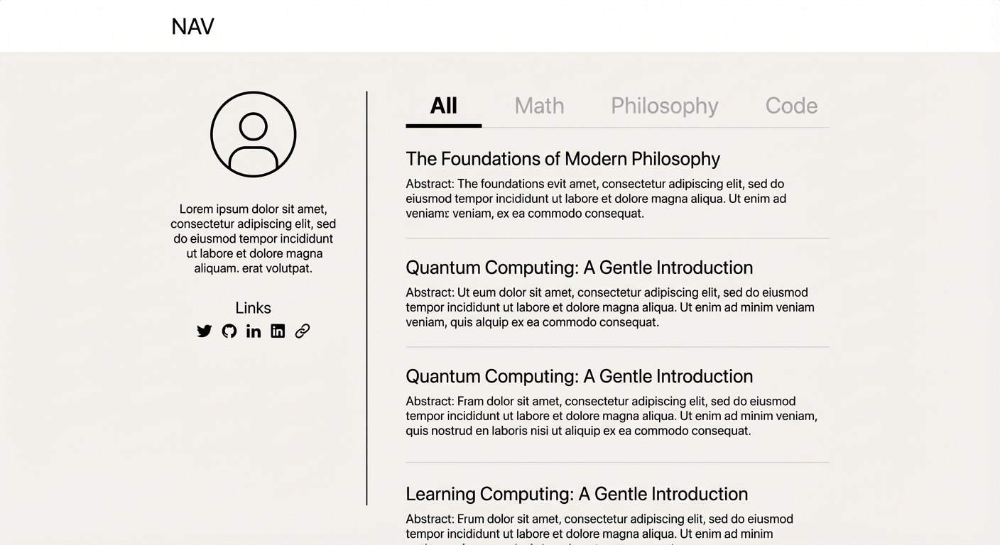

第一阶段，我们主要的工作在于编写页面。这些页面的布局和交互应当被精细地调整，以彰显我的个人审美和哲学。

## 博客内容

数学，哲学，代码。

## 审美

好的网站应当照顾读者的阅读体验

扁平化设计

## 首页

见 

首页包含导航栏，左侧Profile栏，右侧Feed栏。

Profile栏包含Avatar, Introduction和一些icons(links).

Feed栏包含
  一个小分类栏。包含Selected All Math Philosophy Code
  下方是博客流。分页。每一页含10篇博客。每个博客包含标题和摘要。摘要包含发布日期和文字摘要。

## Content & Assets (Milestone 1 baseline)

- 所有文章放在 `src/content/posts/<slug>/index.md`。slug 由目录名唯一确定，不再单独写在 frontmatter（可选字段仅为校验用途）。
- 同一目录下允许存在 `images/` 文件夹，Markdown 通过相对路径 `images/*.jpg` 引用。
- Content Collection 使用 `astro:content` 校验 `title/tags/createdAt/origin/excerpt`，slug 通过 `entry.slug` 读取。
- 文章图片由 Astro 静态资源管线打包，不再依赖 `src/assets/posts`。
- `scripts/import-zhihu.ts`、`scripts/validate-content.mjs` 属于本地工具，不纳入仓库。
