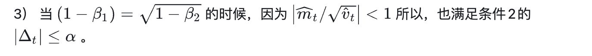

最近笔者读到 [【Adam】优化算法浅析](https://zhuanlan.zhihu.com/p/90169812) ， 里面介绍

这句话毫无证明。我对此表示异议。经过一番探讨，反而发现了偏差修正的一个有趣的作用。

我首先想到的问题是，“ 一阶矩 的滑动平均”除以“ 二阶矩 的滑动平均的开根”是否一定小于等于 $1$ ?

让我们想想有什么公式里面同时出现一阶矩和二阶矩？bingo, 方差 ：

$\text{Var}[X]= \mathbb{E}[X^2] - [\mathbb{E}[X]]^2 \geq 0$

换句话说

$\frac{\mathbb{E}[X]}{\sqrt{\mathbb{E}[{X^2}]}}\leq 1$

也就是说：

*如果指数滑动平均构成期望的良好估计，那么上述命题成立*

这个前提显然让人担忧。Adam考虑了其中影响最大的地方：训练开始。因为Adam选择指数滑动第一项的原则是 **从零开始！** 这相当于让初期的 梯度 强制向零偏移了。这样估计当然是不准确的，并且会导致比例很容易大于1. 这不是我们期望看到的现象， 因为我们希望更新步长被学习率限制，以免训练发散。

让我们简单考虑第一步的情况；这种情况下只有一个梯度，因此

$\frac{m_1}{\sqrt{v_1}} = \frac{(1-\beta_1)g_1}{\sqrt{(1-\beta_2)g_1^2}} = \frac{1-\beta_1}{\sqrt{1-\beta_2}}$

我们只需简单代入 $\beta_1=0.9, \beta_2=0.999$ , （这两个值是adam默认值） 就会发现比例为3.162 >> 1

设置bias correction （1/(1-beta)）的原因也就不言自明了。

> 顺带一提就算如此也不保证比例小于1。但情况变得很少见，因为方差公式从大方向上控制了量级。