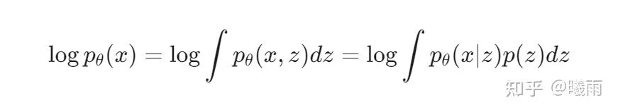
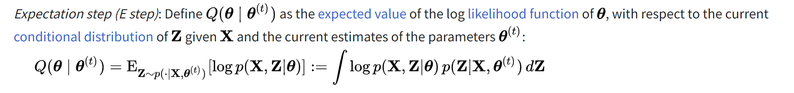

### Evidence Lower Bound (ELBO)

在众多概率模型中, 优化目标常常被设置为最大化 $\log p_{\theta}(x)$ , 其中 $x$ 表示数据. 有一类方法试图借助一个隐向量 $z$ 进行推断(而不是直接建模p(x)):

其中 $p(z)$ 是 $z$ 的先验分布, 通常是一个简单分布, 例如单位高斯分布. 这么做的好处是我们可以从 $p(z)$ 中采样进行生成, 而不仅仅是一个判别模型.

在 [速通RL基础](https://zhuanlan.zhihu.com/p/1938901554229928583) 中我介绍了一个公式做法: 用 蒙特卡洛消积分 . 在这里很容易看出来这是一个对 $z$ 的期望. 但是为什么不直接这么做呢? 因为很难准确采样 有意义的 $z$ 导致算出来的 $p(x'\mid z)$ 接近于零. 我们希望输入和输出都是已知的数据样本, 而不是一个凭空出现的 $z$ .

那该怎么办呢? do a math trick!

### 引入新分布

在重要性采样中, 我们可以通过引入一个 $q$ 分布来转换采样分布. 这里也可以! 实际上这是一个非常常用的数学技巧, 因此我单独将其列为一个小节.

我们可以引入一个新分布 $q(z)$ . 这个分布是我们可控的. 从而使得

$\log \int p(x, z)\mathrm{d}z = \log \int q(z)\frac{p(x, z)}{q(z)}\mathrm{d}z = \log \mathbb{E}[\frac{p(x, z)}{q(z)}]$

再利用 琴森不等式 (怎么记这个不等式呢, 其实就是外面的函数比线性函数高还是低. 如果高(比如说这里log),  那就是大于) , 有

$\log \mathbb{E}[\frac{p(x, z)}{q(z)}] \geq \mathbb{E}_{q(z)}[\log p(x,z) - \log q(z)]$

右侧这个期望就是 大名鼎鼎的 ELBO

> 是不是感觉, 欸, 这么简单?!  (我推出来的时候也有点吓到. 虽然是花了三天才想到这个思路)
> 
> 感觉可以之后写一个blog专门讲"蒙特卡洛到底有什么魔力"(很多人对它的印象可能就是单纯暴力吧hh). 奥妙就在于消去积分号.

### VAE

VAE主要关注生成。所谓生成，就是给定一个先验 $p(z)$ 的情况下，获取一个好的 $p(x\mid z)$ 分布。 所谓好的，就是 $\log p(x) = \int p(z)p(x\mid z)$ 最大的。如之前所属，我们可以通过最大化ELBO来最大化似然。

问题在于 $q(z)$ 是什么形式最好呢？VAE引入的 $q(z)$ 可以写作 $q(z\mid x)$ ，即编码器。如果 $q(z)$ 是一个随机分布，那么它其实相当于 $q(z) = \mathbb{E}_x[q(z\mid x)]$ ， 即所有条件后验的平均值。这会加大训练难度，因为一套参数需要拟合所有数据点的平均；而且效率不一定高。

那么重写ELBO我们就得到

$\mathbb{E}_{q(z\mid x)}[\log p(x, z) - \log q(z\mid x)] = \mathbb{E}_{q(z\mid x)}[\log p(x\mid z)] - \mathbb{E}_{q}[\log q(z\mid x)-\log p(z)]$

后者是 KL散度 。前者可以看成 给定 z后验的情况下得到x的概率，也就是重构损失。

最后，由于符号关系，很可能有读者不能理解到底在训练什么。在这里， $q(z\mid x)$ 和 $p(x\mid z)$ 都是由一个 **模型 （例如高斯分布）** 和一组参数（高斯分布的均值和方差）描述的（而不是一个高维分布；实际上我们也没办法直接表示这种东西）。

### EM

EM是一种优化方法。它不使用梯度。通常情况下，EM的目标其实是推断，目标是推断模型参数，例如某一类人口的均值。这一点要铭记于心。

同样，EM需要最大化似然 $\log p$ ，因此它也不可避免地需要最大化 ELBO. 在这里，我们将 ELBO记为一个二元函数 $\mathcal{L}(\theta, z)$ (数学系大佬补药杀我），有一种经典优化方法： **坐标上升** 。即固定一个变量，优化另外一个变量；然后交替。对于EM算法，由于历史原因不能完全等价，E步实际上多了一点点步骤，而M步因此少了一点点。我们将在下面介绍。

E步：固定 $\theta$ ，此时我们需要优化 $z$ . 等等，我们怎么优化一个隐变量？回顾之前的表达式，我们知道，我们是需要找到一个最优的 $q(z)$ ， 使得 ELBO最大。这样的 $q(z)$ 是什么？直接求解十分困难，但是我们知道，当 $\theta$ 固定的时候，似然 $\log p$ 其实固定了。于是我们可以考察 $\log p$ 和ELBO的差

$\log p - \mathbb{E}_{q(z)}[\log p(x ,z) - \log q(z)] = \mathbb{E}_q[\log \frac{p(x)q(z)}{p(x,z)}] = \mathbb{E}_q[\log \frac{q(z)}{p(z\mid x)}] = \text{KL}(q(z)||p(z\mid x))\geq 0$

我们知道 $\log p$ 是个常数，那最大化 ELBO就是最小化KL散度，而KL散度的最小值是0，并且当且仅当 $q(z) = p(z\mid x)$ 。

换句话说，固定 $\theta$ ，最优的 $q(z)$ 应该 取后验 $p(z\mid x)$ 。实际中怎么求这个后验呢？你会有一个随便取的先验 $p(z)$ , 然后由于固定了 $\theta$ ，所以你可以算出来所有的 $p(x\mid z)$ ，使用贝叶斯公式 $p(z\mid x) = \frac{p(x\mid z)}{p(x)}p(z)$ 即可。注意到 $p(x)$ 就是似然的exp，因此等于算一遍似然。

不过这个没有做完E步（所以我被迷惑了两天）。传统的EM算法描述中，E步不仅仅是算出 $q(z)$ ，还包含使用该 $q(z)$ 作为 **下一轮的先验** 去计算 p(x, z)。这里是最模糊的地方，很多教程都没说明白，我是在揣摩了en wiki半天之后才理解这一点。

可以看到，这里进行了一个服从后验分布的期望计算。

算到这里才算E步结束。

而M步就非常简单了，对theta算一个MLE。