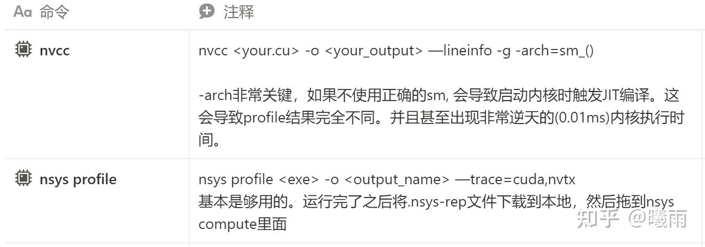
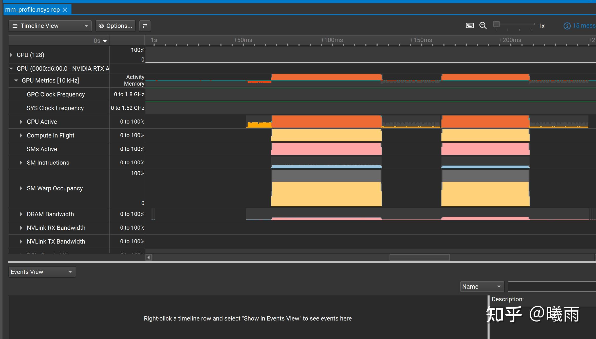
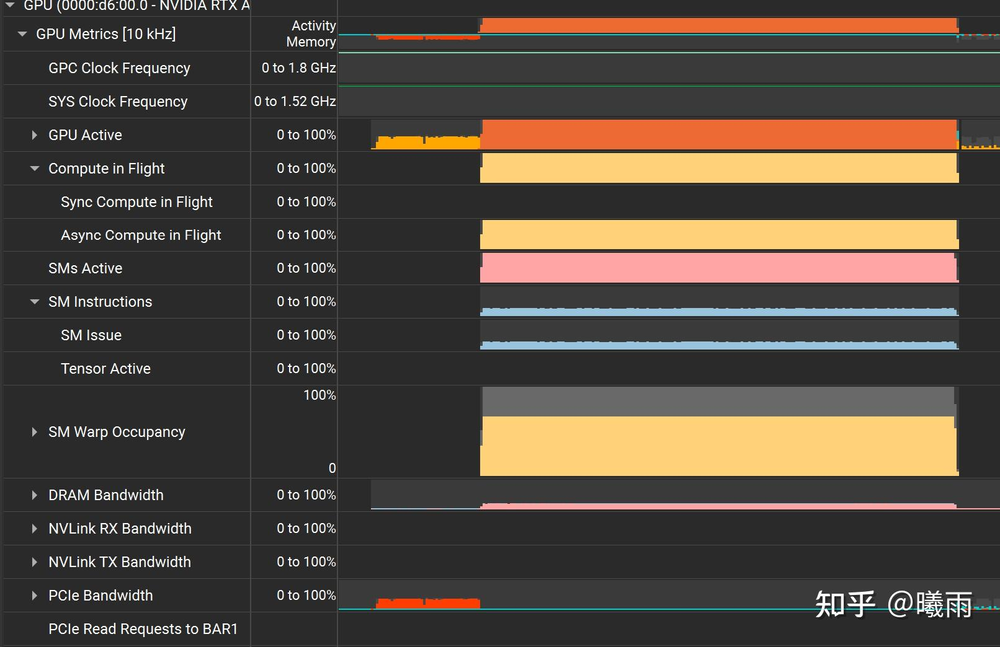
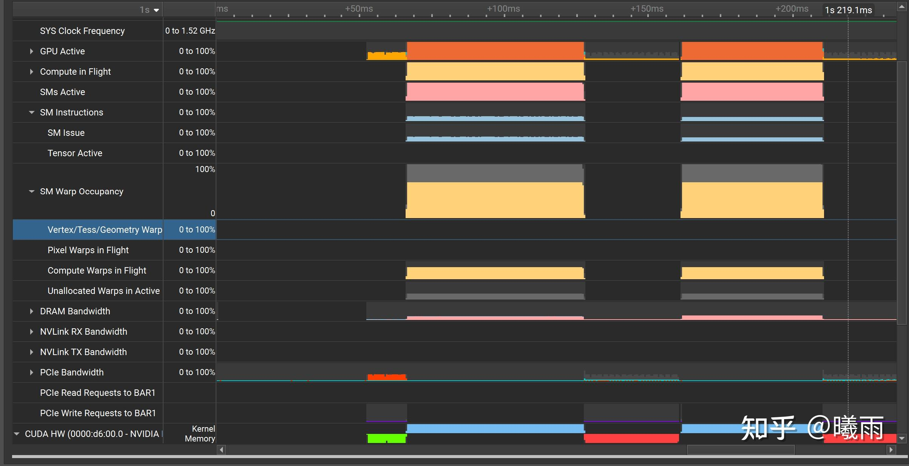

这篇文章记录了我是用nsys profile的一些踩坑点。

首先需要知道profile的大致流程。首先在目标平台编译，运行，然后在主机平台上阅读report. 简单来说，就是在服务器上跑出report之后，下载到本地读。

本地和远程都需要配置 nsight compute . 照着官网配就好了。 [https://developer.nvidia.com/nsight-compute](https://link.zhihu.com/?target=https%3A//developer.nvidia.com/nsight-compute)

基础：



这里需要特别强调-arch参数。如果不使用这个参数，nvcc只会生成一个中间代码（PTX），真正运行时将变成JIT compile,  导致profile里面的数据无意义，无法追踪具体的内核启动情况。查询arch参数就是上官网查显卡型号，然后会有一个compute capability, 比如说我用的A6000是8.6，那么就是sm_86。

这种情况下生成的profile只能看到简略的执行时间，看不到内部细节。为了达到这一点，需要使用gpu-metrics-device（注意，某些版本是gpu-metrics-devices, 需要根据自己nsys版本去调。多用--help）控制; 而使用这个符号必须使用sudo启动nsys, 因为访问显卡寄存器资源需要特权。

```text
sudo nsys profile --gpu-metrics-device=1 -o output <your_obj>
```

特别注意这个profile可能和 DCGM 冲突：

[https://forums.developer.nvidia.com/t/nsys-profile-gpu-metrics-devices-fails-with-already-under-profiling/333938/12forums.developer.nvidia.com/t/nsys-profile-gpu-metrics-devices-fails-with-already-under-profiling/333938/12](https://link.zhihu.com/?target=https%3A//forums.developer.nvidia.com/t/nsys-profile-gpu-metrics-devices-fails-with-already-under-profiling/333938/12)

这种情况下得到的输出截图如下：



我们可以看到SM启动率，DRAM（也就是HBM）带宽等信息。注意nsys 读不到HBM的读写次数（或者说读写数据量），这个需要上NCU分析。因此nsys只适合定位瓶颈不适合改进内核。

这里我启动了两个矩阵乘内核进行对比：

```text
#include <cuda_runtime.h>
#include <stdio.h>
#include <stdlib.h>
#include <math.h>

#define MATRIX_SIZE 4096
#define BLOCK_SIZE 32

// Simple matrix multiplication kernel (naive implementation)
__global__ void matrixMulNaive(float *A, float *B, float *C, int N) {
    int row = blockIdx.y * blockDim.y + threadIdx.y;
    int col = blockIdx.x * blockDim.x + threadIdx.x;
    
    if (row < N && col < N) {
        float sum = 0.0f;
        for (int k = 0; k < N; k++) {
            sum += A[row * N + k] * B[k * N + col];
        }
        C[row * N + col] = sum;
    }
}

// Optimized matrix multiplication with shared memory
__global__ void matrixMulShared(float *A, float *B, float *C, int N) {
    __shared__ float As[BLOCK_SIZE][BLOCK_SIZE];
    __shared__ float Bs[BLOCK_SIZE][BLOCK_SIZE];
    
    int bx = blockIdx.x, by = blockIdx.y;
    int tx = threadIdx.x, ty = threadIdx.y;
    
    int row = by * BLOCK_SIZE + ty;
    int col = bx * BLOCK_SIZE + tx;
    
    float sum = 0.0f;
    
    for (int m = 0; m < (N + BLOCK_SIZE - 1) / BLOCK_SIZE; m++) {
        // Load tiles into shared memory
        if (row < N && m * BLOCK_SIZE + tx < N)
            As[ty][tx] = A[row * N + m * BLOCK_SIZE + tx];
        else
            As[ty][tx] = 0.0f;
            
        if (col < N && m * BLOCK_SIZE + ty < N)
            Bs[ty][tx] = B[(m * BLOCK_SIZE + ty) * N + col];
        else
            Bs[ty][tx] = 0.0f;
            
        __syncthreads();
        
        // Compute partial dot product
        for (int k = 0; k < BLOCK_SIZE; k++) {
            sum += As[ty][k] * Bs[k][tx];
        }
        
        __syncthreads();
    }
    
    if (row < N && col < N) {
        C[row * N + col] = sum;
    }
}

// CPU reference implementation
void matrixMulCPU(float *A, float *B, float *C, int N) {
    for (int i = 0; i < N; i++) {
        for (int j = 0; j < N; j++) {
            float sum = 0.0f;
            for (int k = 0; k < N; k++) {
                sum += A[i * N + k] * B[k * N + j];
            }
            C[i * N + j] = sum;
        }
    }
}

int main() {
    // 强制设置使用GPU设备7
    cudaSetDevice(7);
    
    // 验证设备设置
    int device;
    cudaGetDevice(&device);
    printf("当前使用的GPU设备: %d\n", device);
    
    printf("矩阵乘法Profiling示例\n");
    printf("矩阵大小: %dx%d\n", MATRIX_SIZE, MATRIX_SIZE);
    
    size_t size = MATRIX_SIZE * MATRIX_SIZE * sizeof(float);
    
    // Host memory allocation
    float *h_A = (float*)malloc(size);
    float *h_B = (float*)malloc(size);
    float *h_C_naive = (float*)malloc(size);
    float *h_C_shared = (float*)malloc(size);
    
    // Initialize matrices
    for (int i = 0; i < MATRIX_SIZE * MATRIX_SIZE; i++) {
        h_A[i] = rand() / (float)RAND_MAX;
        h_B[i] = rand() / (float)RAND_MAX;
    }
    
    // Device memory allocation
    float *d_A, *d_B, *d_C;
    cudaMalloc(&d_A, size);
    cudaMalloc(&d_B, size);
    cudaMalloc(&d_C, size);
    
    // Copy input data to device
    cudaMemcpy(d_A, h_A, size, cudaMemcpyHostToDevice);
    cudaMemcpy(d_B, h_B, size, cudaMemcpyHostToDevice);
    
    // Setup grid and block dimensions
    dim3 blockDim(BLOCK_SIZE, BLOCK_SIZE);
    dim3 gridDim((MATRIX_SIZE + BLOCK_SIZE - 1) / BLOCK_SIZE, 
                 (MATRIX_SIZE + BLOCK_SIZE - 1) / BLOCK_SIZE);
    
    printf("Grid: %dx%d, Block: %dx%d\n", 
           gridDim.x, gridDim.y, blockDim.x, blockDim.y);
    
    // === 测试1: Naive矩阵乘法 ===
    printf("\n=== 运行Naive矩阵乘法 ===\n");
    
    cudaEvent_t start_naive, stop_naive;
    cudaEventCreate(&start_naive);
    cudaEventCreate(&stop_naive);
    
    cudaEventRecord(start_naive);
    matrixMulNaive<<<gridDim, blockDim>>>(d_A, d_B, d_C, MATRIX_SIZE);
    cudaEventRecord(stop_naive);
    cudaEventSynchronize(stop_naive);
    
    float time_naive;
    cudaEventElapsedTime(&time_naive, start_naive, stop_naive);
    printf("Naive实现执行时间: %.2f ms\n", time_naive);
    
    cudaMemcpy(h_C_naive, d_C, size, cudaMemcpyDeviceToHost);
    
    // === 测试2: Shared Memory优化的矩阵乘法 ===
    printf("\n=== 运行Shared Memory优化矩阵乘法 ===\n");
    
    cudaEvent_t start_shared, stop_shared;
    cudaEventCreate(&start_shared);
    cudaEventCreate(&stop_shared);
    
    cudaEventRecord(start_shared);
    matrixMulShared<<<gridDim, blockDim>>>(d_A, d_B, d_C, MATRIX_SIZE);
    cudaEventRecord(stop_shared);
    cudaEventSynchronize(stop_shared);
    
    float time_shared;
    cudaEventElapsedTime(&time_shared, start_shared, stop_shared);
    printf("Shared Memory实现执行时间: %.2f ms\n", time_shared);
    printf("性能提升: %.2fx\n", time_naive / time_shared);
    
    cudaMemcpy(h_C_shared, d_C, size, cudaMemcpyDeviceToHost);
    
    // Simple verification (check a few random elements)
    bool success = true;
    for (int i = 0; i < 10; i++) {
        int idx = rand() % (MATRIX_SIZE * MATRIX_SIZE);
        if (abs(h_C_naive[idx] - h_C_shared[idx]) > 1e-3) {
            success = false;
            break;
        }
    }
    
    printf("结果验证: %s\n", success ? "通过" : "失败");
    
    // Cleanup
    free(h_A); free(h_B); free(h_C_naive); free(h_C_shared);
    cudaFree(d_A); cudaFree(d_B); cudaFree(d_C);
    cudaEventDestroy(start_naive); cudaEventDestroy(stop_naive);
    cudaEventDestroy(start_shared); cudaEventDestroy(stop_shared);
    
    return 0;
}
```

简单来说，第一个内核就是简单的逐点计算点乘，第二个内核则使用了Shared Memory进行优化。代码中检测到的加速比大概是1.3x. 我们先来看看第一个内核的nsys

## 熟悉指标

> sudo nsys profile --gpu-metrics-device=7 -o mm_profile mm



主要指标如下：

GPU active: GPU活跃度，意义不是很大。这个指标展开内部可以看到copy/GR活跃度，有助于你判断瓶颈在传输还是计算（注意这个只能判断主机-GPU，没法判断内核）, 不如直接看warp/SM相关指标

Compute in Flight: 显示计算队列的繁忙程度。这是通过GPU采样计算的，算的是采样次数中有多少次该队列繁忙。一个很弱的指标。

SM Active：有多少SM **至少有一个WARP在运行。**

SM Issue：一个关键指标。这个指标衡量的是 SM 内部的指令发射单元的繁忙程度。(The ratio of cycles that SM sub-partitions (warp schedulers) issued an instruction to the number of cycles in the sample period as a percentage）

如图所示，这个值非常低，说明计算单元执行的指令很少，没有吃满计算资源。 **该值低的直接原因是正在执行的WARP很少；常见于grid/block开小了没吃满硬件资源，或者WARP被访存卡住了。**

SM Warp Occupancy: 活跃的WARP数比SM最大warp数。这个值和上面的SM Issue互相印证。在图中，SWO只有67%。

> 本来打算算一下理论吞吐的，但是发现nsys没有device attributes, 再研究一下。

DRAM: 这就是常说的HBM带宽。nsys只能看到带宽，数据读写量需要靠ncu分析。因此意义虽然有一点儿但不大。

### 对比

这里有一个非常有意思的现象（第一段是naive, 第二段上了shared mem优化）：



共享内存版本的SM Issue **低于** 普通版本， **但是更快**

这个现象很有趣，欢迎评论区的大伙指导一下（

经过一段时间的挖掘，很可能和 `__syncthreads()` 有关。见 [Issue Efficiency](https://link.zhihu.com/?target=https%3A//docs.nvidia.com/gameworks/content/developertools/desktop/analysis/report/cudaexperiments/kernellevel/issueefficiency.htm%23Background)

> 顺带一提我和gemini-2.5-pro辩论了半个多小时也没搞清楚这个问题，这个同步问题还是我自己发现的。 它不知为何非常执着于告诉我naive kernel会调度warp来掩盖时延，我寻思难道shared就不了？