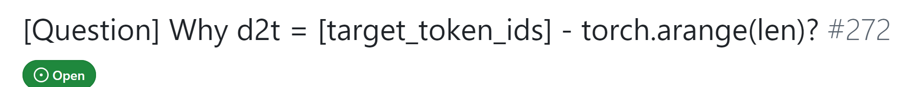

> 记录一下
> 
> specForge
> 
> 的一些代码点。仅供速查

```python
t2d = torch.zeros(self.vocab_size, dtype=torch.bool)
d2t = torch.zeros(self.draft_vocab_size, dtype=torch.int64)
self.register_buffer("t2d", t2d)
self.register_buffer("d2t", d2t)
```

这两个buffer会保存 vocab mapping , 然后加载的时候又load回来。

推测解码的神秘偏移, 导致我浪费了三个多小时

[https://github.com/sgl-project/SpecForge/issues/272#issuecomment-3477447352github.com/sgl-project/SpecForge/issues/272#issuecomment-3477447352](https://link.zhihu.com/?target=https%3A//github.com/sgl-project/SpecForge/issues/272%23issuecomment-3477447352)

