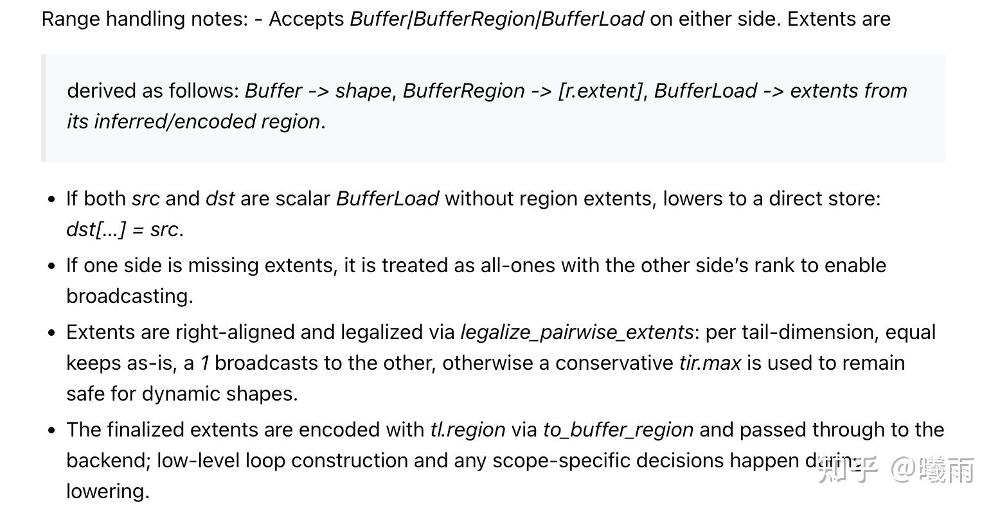

这篇文章只是一篇碎碎念笔记，防止我很快就忘了之前看过什么。

你将会看到一篇文章里面：

1. 说梦话
2. 前后左右脑互搏
3. 无限碎碎念

这些都是刻意为之，为了保留我的思考痕迹。在这一点上，我很讨厌高斯先生的狐狸做派。

> 实际上写这篇笔记时我只是翻来覆去阅读了tilelang那不算太好的文档
> 
> [https://tilelang.com/programming_guides/language_basics.html](https://link.zhihu.com/?target=https%3A//tilelang.com/programming_guides/language_basics.html)
> 
> 这算不上符合
> 
> [具体一点，再具体一点](https://zhuanlan.zhihu.com/p/1988012490630648734)
> 
> 中所描述的哲学。实际上我缺乏一个明确的目标和停止点。
> 
> 不过倒也可以考虑一下。我的当前状态是GPU没那么好申请，不是很好直接跑程序。而且，就算跑程序，跑出来又有什么意义呢？我想了一下，关键在于我是否能建立对tilelang的概念的可靠信念，其期望结果是：当我遇到一个新的高性能需求时，可以使用tilelang完整编写，达到 1. 数值准确度（这衡量了我是否准确理解了tilelang的工作机制）2. 速度 （这衡量了我对tilelang的高级特性有多么熟悉）。
> 
> 通过这番梳理，我也可以总结tilelang文档，在当前的我看来有什么问题：缺乏准确的概念和行为约束。最简单的例子是，
> 
> T.Kernel
> 
> 到底返回了一个什么东西，以至于既可以写成
> 
> `bx`
> 
> 又可以写成
> 
> `(bx, by)`
> 
> …… (这个问题我通过翻api解决了。但是翻api真的太慢了）此外我认为tilelang应当降低编写负担，而不是对cuda常用模式的总结和缩写。要想真正地降低思维负担，就需要一个坚实的不变的抽象，像
> 
> Torch
> 
> 那样。
> 
> 那么我的目标大概可以这么确定：寻找一个稍微复杂一点的算子（可以通过问GPT），编写tilelang实现，交由GPT查验是否通过。等到有GPU后，可以上机跑，先和参考实现确保数值准确。

顺带一提我注意到tilelang里面写的最易懂的一页文档是 [https://tilelang.com/deeplearning_operators/gemv.html](https://link.zhihu.com/?target=https%3A//tilelang.com/deeplearning_operators/gemv.html)

和其他文档的语风完全不一样（感觉有 triton 之姿）。也很感谢这页文档，让我能连蒙带猜tilelang的核心概念。

### Example 1

```python
import tilelang
import tilelang.language as T
from tilelang.intrinsics import make_mma_swizzle_layout

def matmul(M, N, K, block_M, block_N, block_K, dtype="float16", accum_dtype="float"):
    @T.prim_func ## T.prim_func是tilelang的入口装饰器。 
                 #被该装饰器装饰后，tilelang会试图编译此函数
    def main(
        A: T.Tensor((M, K), dtype), ##tilelang使用Tensor显式声明行如shape,dtype的tensor
        B: T.Tensor((K, N), dtype),
        C: T.Tensor((M, N), dtype),
    ):
        # Initialize Kernel Context
# T.kernel是tilelang的Kernel上下文。被该上下文捕捉的块意味着会在核内运行
# T.kernel(*blocks, *threads)的参数列表的意思是：
# 一个变长blocks，对应gridDim.x, y, z
# 变长threads（kw-only）, 对应blockDim.x, y, z
# 返回值是 Tuple[tilelang.language.kernel.KernelLaunchFrame]
# 注意文档有误。我这里直接跑去搜索了 ir.cc注意到这个问题。
# 返回值是list[tvm.tir.Var]，其实际含义为blockIndex.x, y, z的绑定。
        with T.Kernel(T.ceildiv(N, block_N), T.ceildiv(M, block_M), threads=128) as (bx, by):
            A_shared = T.alloc_shared((block_M, block_K), dtype) ##exactly __shared__ sm[][]
            B_shared = T.alloc_shared((block_K, block_N), dtype)

         #alloc_fragment申请了一块fragment mem. 它对应着warp共享的寄存器。这是一个tensor core的概念
            C_local  = T.alloc_fragment((block_M, block_N), accum_dtype)

            # set C_local to 0s
            T.clear(C_local)

            #pipeline并行. tilelang会识别出访存/计算命令，然后构建消费者/生产者流水线
          #num_stages=3代表构建三缓冲。num_stages=2是双缓冲。
            for ko in T.Pipelined(T.ceildiv(K, block_K), num_stages=3):
                # T.copy(src, dst)
                
                T..copy(A[by * block_M, ko * block_K], A_shared)

                # Parallel copy tile of B from global to shared memory
                for k, j in T.Parallel(block_K, block_N):
                    B_shared[k, j] = B[ko * block_K + k, bx * block_N + j]

                # Perform a tile-level GEMM
                T.gemm(A_shared, B_shared, C_local)

            # Copy result from local (register fragment) to global memory
            T.copy(C_local, C[by * block_M, bx * block_N])

    return main
```

T.copy有个神秘的广播语法（我初读代码时怎么也不能理解为什么把标量全赋值到A_shared)



简单来说, *`A[by * block_M, ko * block_K]` 这个东西传递到T.copy时，T.copy会获取它的底层指针。而这个tensor的region是1（一个元素）。目标是A_shared, 也是一个指针+region。而A_shared的region比A[] 要大，于是region会发生一个广播（注意不是tensor内容广播）。这个广播的结果是计算出需要复制的字节总数。*

底层是一个 DMA引擎 。它取得两个指针和复制的字节数。所以看上去就是从A，起点为 `b*block, k*block` 的块复制到A-shared.

tilelang应当使用一个更显式的语法……

> 先写到这里，interrupt了