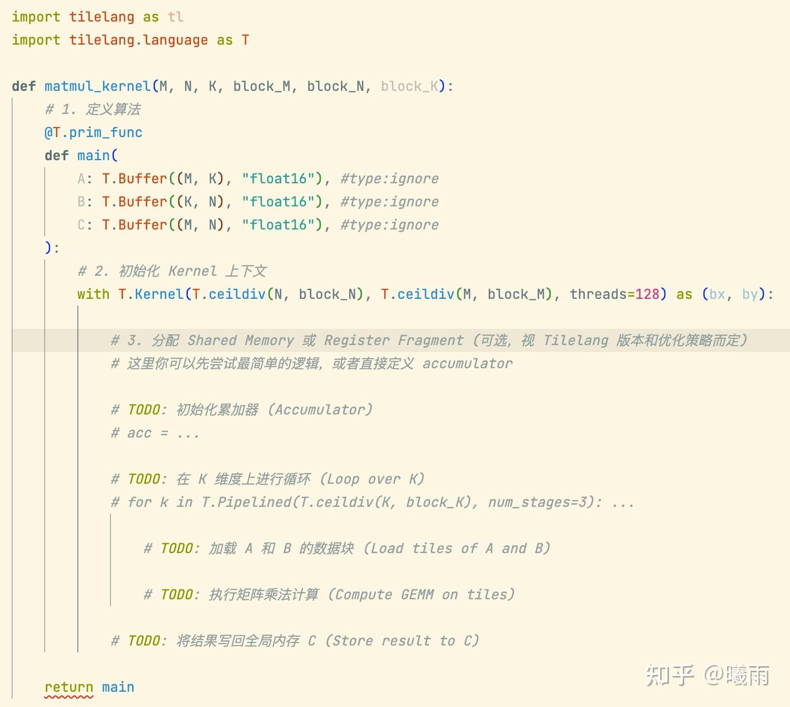
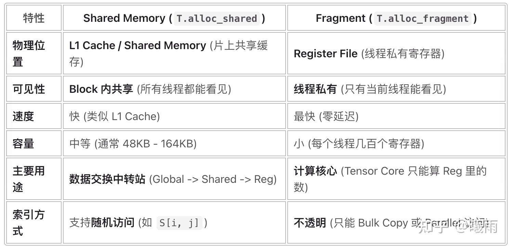
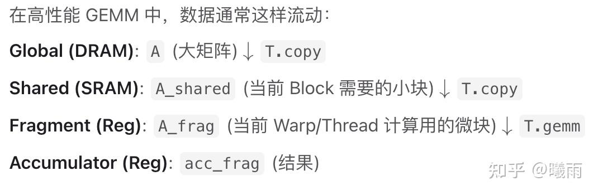
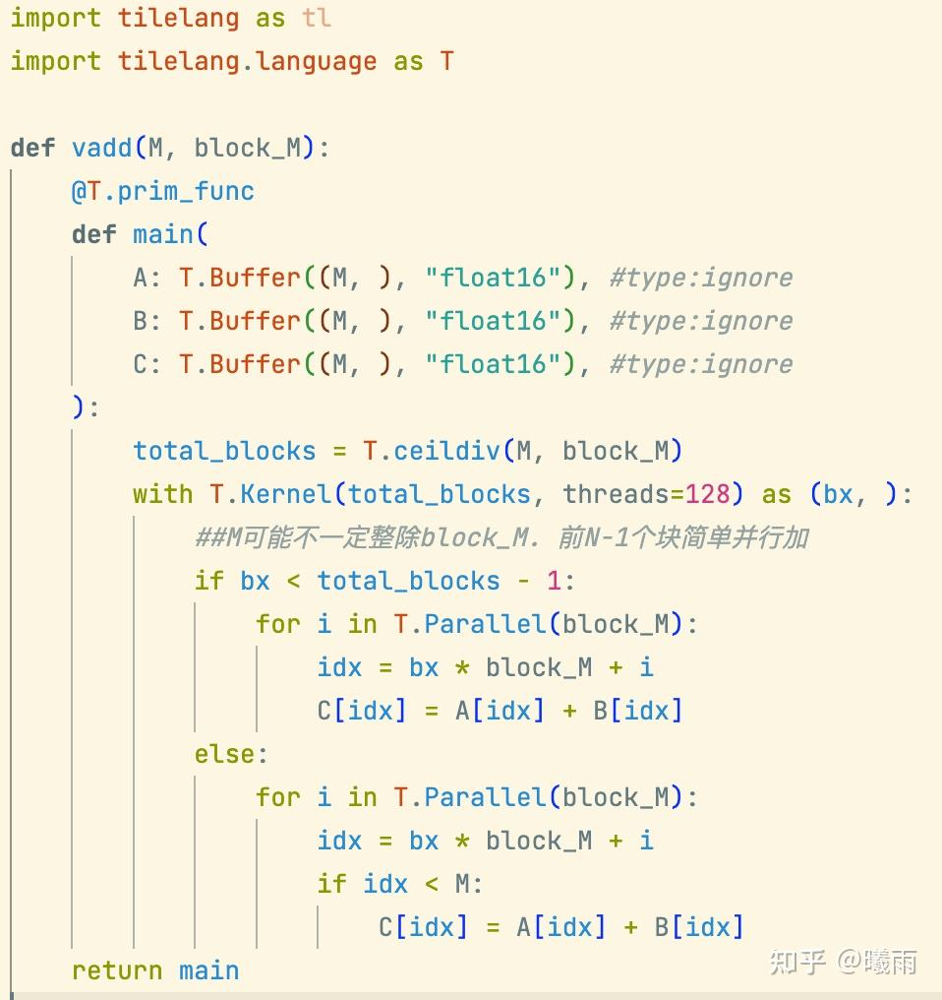
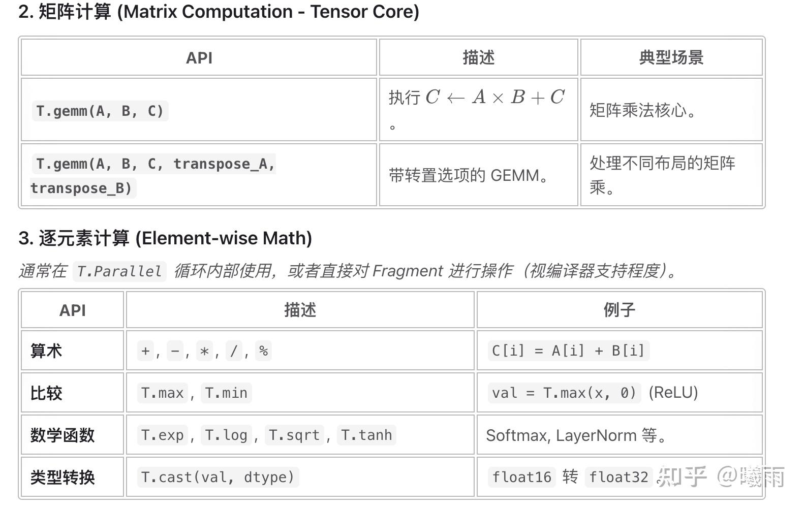
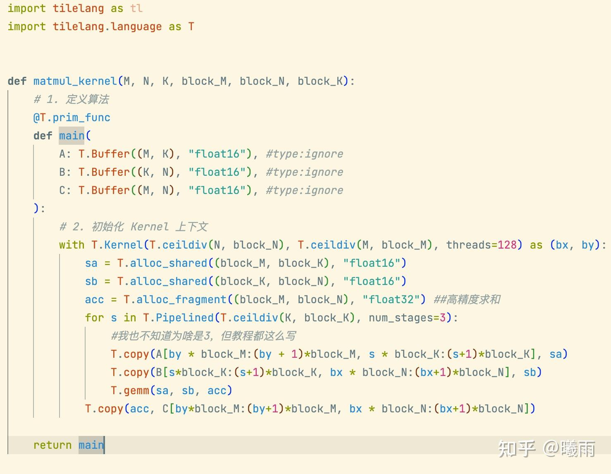
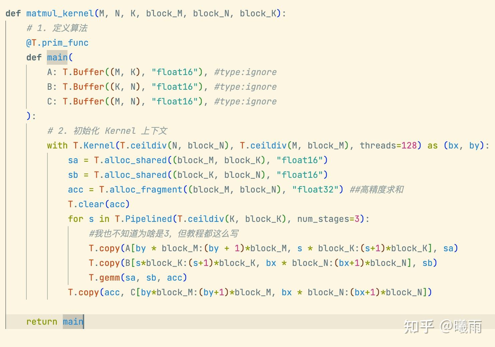

上一篇

[TileLang笔记](https://zhuanlan.zhihu.com/p/1989012911822233911)

本篇同样保留了我的所有碎碎念。

> 因此这不是一篇适合所有人阅读的文章。

这回我从 Gemini 那里领到了一个任务：



> 吐槽：Pylance会对
> 
> T.buffer
> 
> 这个写法报错（在类型注释里调用函数）。我很好奇tilelang的开发者用户全部都能忍受这种红色波浪线写下去吗……

拿到这个骨架之后，我意识到第一个问题是：我该如何声明一个tilelang变量？

旋即，我意识到我不知道这段代码本身想表达何种“意图”。我对tilelang的编程模型缺乏认知。

经过我对gemini的一系列追问之后，得到：

1. 被 T.Kernel 包裹的代码是一个“块”的行为集合。 Tilelang 在块级别编程。
2. 你可以很正常地使用 `x= by * 2` 来声明简单的临时变量（int, float之类的）。
3. 可以使用 `alloc_fragment` 分配寄存器。例如 `acc = alloc_fragment([128, 128])` 请注意，正因为Tilelang在块级别编程，所以 `acc` 是一个 “弥散” 在整个块里面的寄存器组。它是一个不透明布局Opaque Layout，不连续，不能简单地使用i,j进行随机访问。 在特殊的场景下（例如T.parallel构建的线程环境内），可以通过i,j访问。（语法上你总是可以访问，但只有这种场景下才不会报错） 也因此， `fragment` 类型的变量只能进行批次操作（例如批次传输，批次计算）。 使用 `copy` 传输， `clear` 置零。 它最常见的用法是作为 `T.gemm` 的输出参数
4. T.Buffer等价于 T.Tensor . 说明这是一个存在Global Memory里面的tensor

这里有一个细节需要说明。Tilelang是一门描述线程块的DSL, 因此操作最好使用整块（例如切片），tilelang会自己处理好底层的并行问题。如果你展开到线程级别（例如Parallel），那么你就只能操作一个元素。

说起来有点麻烦。我们看一个例子。假设我声明了 `A: T.Buffer((1024, 1024), "float16")`

我需要将A中的一小块搬到一个32线程组成的块内（暂时让我用fragment内存说明）：

```text
with T.Kernel(32, 32, threads=32) as bx, by:
  A_frag = T.alloc_fragment((128, 128), "float16")
  A_tile = A[0:128, 0:128]
  T.copy(A_tile, A_frag) 
```

tilelang会自己在底下处理好“使用32个线程搬运128*128数据块”这样一个任务。

但如果你使用Parallel,由于Parallel管辖的块是线程（ **注意，是逻辑线程，不是物理线程** ），所以你只能自己手动复制：

```text
for i, j in T.Parallel(128, 128):
    A_frag[i, j] = A[i, j] 
```

在明白Fragment之后，我就需要了解一下Shared了：

```text
# 声明一个 128x32 的 float16 共享内存块
A_shared = T.alloc_shared((128, 32), "float16")
```



Gemini写的这个总结真挺不错：



中场休息时间：

截止现在，我学习了：

声明入口Tensor:

```text
A: T.Buffer(shape, dtype)
```

两种内存声明方式：

```text
T.alloc_fragment(shape, dtype) ##弥散在块内，只能以块状访问，数量受限
T.alloc_shared(shape, dtype) ##被块共享，就是cuda的shared mem. 数量可以多一点（但也不是无限的）
```

移动方式：

```text
T.copy(src, dst) # 从src开始的字节，输入到dst.
#通常，src和dst不是同一种内存。所以T.copy就是默认的跨内存层次传输数据的操作

#如果src region（大致可以看成shape) < dst region，那么广播src的region，使其等同于dst的region大小（例如一个元素扩张成N*N个）。
#由于开头指针还是src, 所以等价于从src开始左上角的字节复制过去。
#如果dst region < src region，同样。但这是一个危险的操作，因为dst不一定准备好了那么长的区域。
#无论如何，建议src和dst都是一样的形状以避免意外。
```

写一个简单的vector add:



[https://tilelang.com/deeplearning_operators/elementwise.html](https://link.zhihu.com/?target=https%3A//tilelang.com/deeplearning_operators/elementwise.html) 中有一个更加高度优化的vadd核。

接下来是控制流。Tilelang中最常用的有三种控制流：

1. `T.Parallel` 。如前所述，这用于创建完全并行的逻辑任务。任务之间毫无关联
2. `T.Serial` 。这个和Python的range一样。顺序执行，提供迭代步数的下标。
3. `T.Pipelined` 。这个自动创建多级流水线（被num_stages）控制。Tilelang会识别你接下来块中的copy和计算，然后自动构建生产者/消费者流水线，重叠拷贝和计算。

tilelang为我们提供了哪些算子呢？



[https://tilelang.com/programming_guides/instructions.html](https://link.zhihu.com/?target=https%3A//tilelang.com/programming_guides/instructions.html) 该页面有更全面的介绍，good👍

> 这里面有很多特定于架构的原语。在之后的文章中尽量介绍（如果我有机会去H卡上优化的话……）

实际上，我们只需要知道 `T.gemm(A, B, C)` ，就足够开始写Gemm算子了。特别注意，这里要求 `C` 是一个fragment（寄存器），因为它是累加寄存器地址。

最终的Gemm算子：

在cuda里面Gemm属于必吃榜榜一， [【cuda入门】共享内存优化矩阵乘](https://zhuanlan.zhihu.com/p/1900941224883516265) 中也介绍了cuda中通常如何计算。这里再简单回顾一下：

对于 C = A*B运算而言，可以简记为

`[i, j ]= [i, :] * [:, j]` 中间维度就是K维度。

我们将 K 维度分块，就有

`[i,j]=[i, 0:k] * [0:k, j] + [i, k:2k]*[k:2k, j]+...`

我们可以观察以下例子：

1. 对于 `[i,j]` , 需要 `[i, 0:k] * [0:k, j]`
2. 对于 `[i+1, j]` , 需要 `[i+1, 0:k] * [0:k, j] `
3. 对于 `[i, j + 1]` , 需要 `[i, 0:k] * [0:k, j+1]`
4. 对于 `[i+1, j +1]` , 需要 `[i+1, 0:k] * [0:k, j+1]`

你会发现，在每一步，K维度上的需求其实是一样的。而主要是M和N维度上有轻微的变化，导致这四个元素之间有些块重叠，有些不重叠。例如[i, j]和[i+1, j]需要同样的B块，不同的A块；[i, j]和 [i, j+1]需要同样的A块，不同的B块。只有将这四个元素的所需全部“求个并集”，我们才能恰好满足所有元素的需求。

> 我喜欢在这里做一个想象：想象[i, j]在“大鹏展翅”，覆盖一个矩阵，使得自己所使用的块和其他元素能重叠。

形式化地讲，对于块 `C[i:i+k, j:j+k]` 而言，在第 `s` 步，他们需要：

1. `A[i:i+k, s*k:(s+1)k]`
2. `B[s*k:(s+1)k, j:j+k]`
3. 没有其他内存需求，所以他们可以共享上述两个小块（不妨叫a_tile和b_tile）。

在每一步，我们只需计算一个小规模的gemm: `acc += a_tile * b_tile` 即可。Tilelang就是提供了一个小规模的gemm算子 `T.gemm(A,B, C_frag)` 。它等于 `C_frag += A * B`

了解了这些之后，Tilelang编写gemm就呼之欲出了：



看上去不错！

但是不知道有没有细心的读者注意到，其实这段代码里面有问题？

答案：初始化acc时忘记清零了！

以下才是正确答案：



> 你已经学会tilelang了，快去重写DeepGemm吧