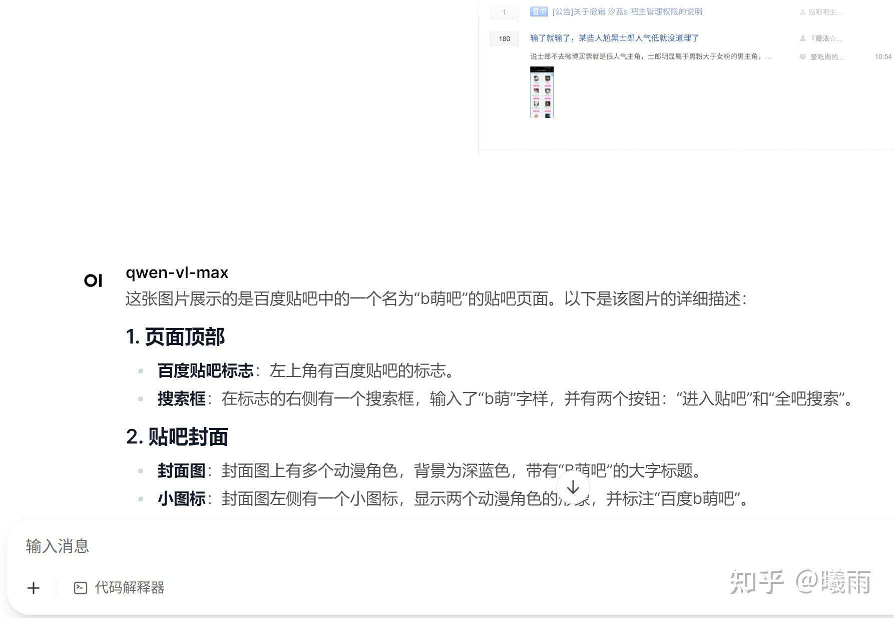

check this github repo:

[https://github.com/Tomorrowdawn/VLMWalk/tree/maingithub.com/Tomorrowdawn/VLMWalk/tree/main](https://link.zhihu.com/?target=https%3A//github.com/Tomorrowdawn/VLMWalk/tree/main)

我知道知乎上很多人都对配对话UI没啥热情, 反正 CLI 聊不也是聊吗, 测试而已.

但是我发现漂亮的UI对于研究积极性还是很有推动性的, 而且CLI总会遇到很多麻烦的事情, 比如说你想要传图片, 编写复杂格式文本之类的都没办法. 顺带, 装一次UI很有利于学习 Docker .

为了方便起见，而且我们也不会动UI的代码，我强烈推荐用 Docker。

很多人（包括一天前的我）对现代开发工具包都不太熟悉，所以值得写个docker指南。

Docker是一个【你知道它很牛逼我也不想念八股但是似乎这里必须得有一个宾语所以我写了这么多废话】。 [https://yeasy.gitbook.io/docker_practice/install/ubuntu](https://link.zhihu.com/?target=https%3A//yeasy.gitbook.io/docker_practice/install/ubuntu) 如果你想变成Docker高手, 读读这个.

对于安装 OpenWebUI (为什么是它? 答案是Google第一名), 我们只需学习两条指令: docker run和docker pull.

```bash
docker run --rm -d -p host_port:container_port -v host_addr:container_port --name [name] -e ENV=VALUE [IMAGE]
```

这行命令看起来很长很复杂，别担心，让我一个个解释：

--rm：这个参数的意思是"用完就删"。有些人可能会说"保留容器对调试很重要"，但下一次启动的时候会告诉你名字冲突……我讨厌这个。

-d：后台运行。

-p host_port:container_port： 端口映射 。

-v host_path:container_path： 卷挂载 ，这样container访问container_path时会直接访问host_path。Docker喜欢把主机路径放在前面，就像主语在前一样。

--name container_name：给容器起个名字，不然Docker会给你起个"sleepy_galileo"这种奇怪的名字。而且rm的时候比较方便。

-e KEY=value：设置 环境变量 。

[IMAGE]：镜像名。 顺带一提在这个参数之后的参数将被解释为传递给镜像的参数……我第一次启动时候错误地把前面的参数挪到了后面，调了半天。

```bash
docker pull ghcr.io/open-webui/open-webui:main
```

下载镜像。

顺带一提，国内docker需要克服一些网络问题…… 我暂时还没遇到

运行open webui的话非常简单：

```bash
docker run -d -p 3000:8080 -v open-webui:/app/backend/data --name open-webui ghcr.io/open-webui/open-webui:main
```

然后访问3000端口（例如用vscode 的port forward）即可。



来点对话截图。

在之后，只需要将OPENAI_BASE_URL替换成譬如SGLang/vllm提供的服务地址即可开始本地开发了）

> 扯淡时间：下次红A遇到5t5还能“ついて来れるか”吗