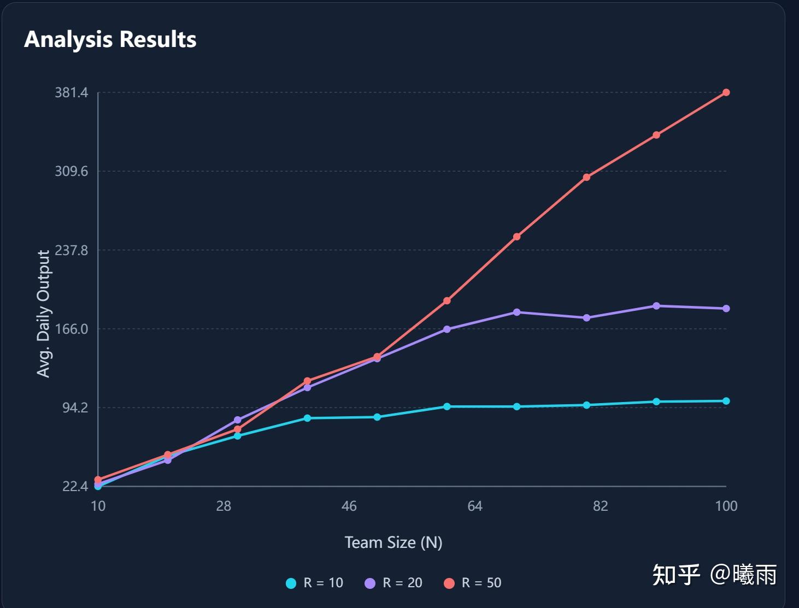
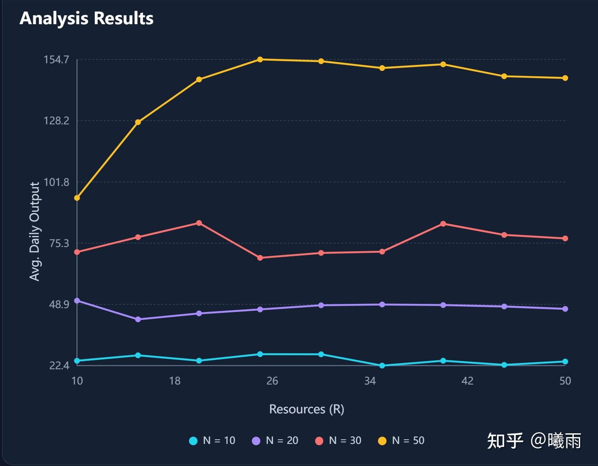
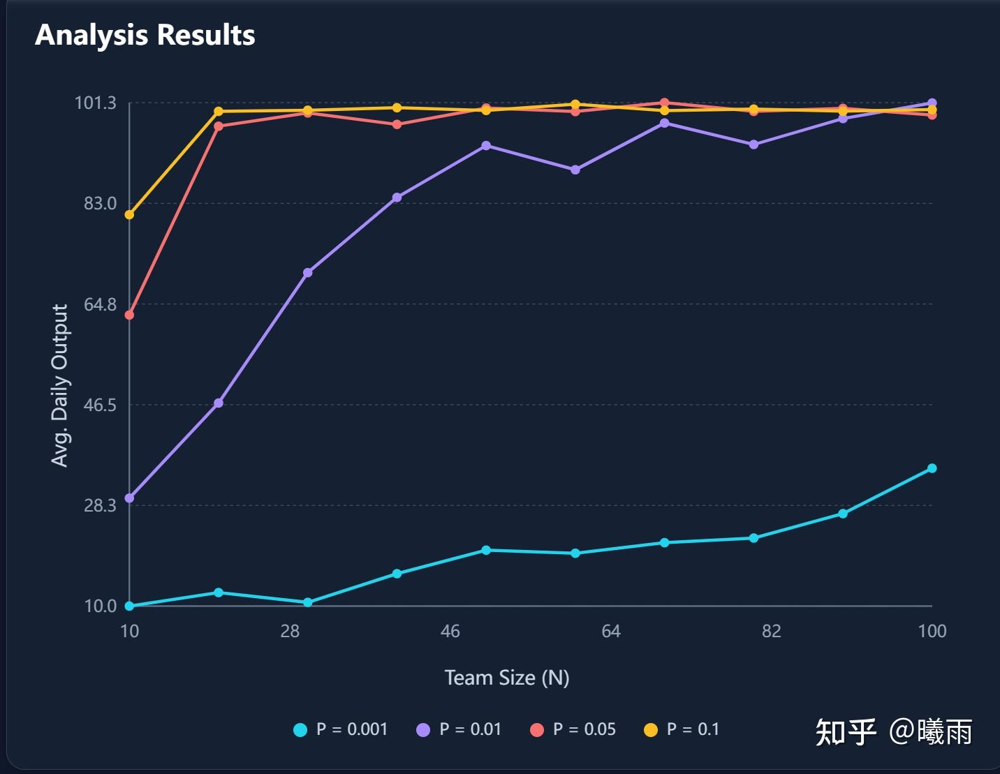
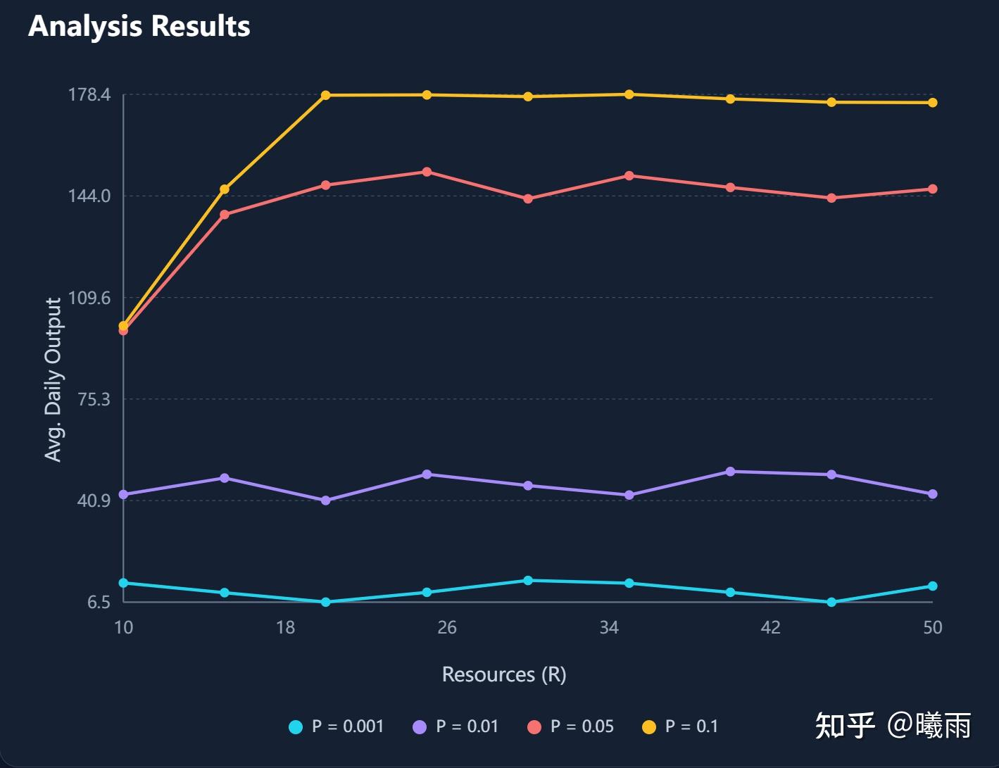

[Talent Dilution Roofline：算法团队可能人越多产出越低](https://zhuanlan.zhihu.com/p/1972742408778311566) 这是一篇有趣的文章。读完之后，我立刻用 Gemini Build 造了一个 simulator 来verify这件事情。 [https://github.com/Tomorrowdawn/ProductivitySimulator](https://link.zhihu.com/?target=https%3A//github.com/Tomorrowdawn/ProductivitySimulator)

这个模拟器主要有以下几个变量：

1. 团队人数
2. 资源数
3. 占用资源时间
4. 产生idea概率
5. 个人平均每单位每资源产出

运行规则如下：

每人每天有 idea prob 概率产出一个想法。此时他会请求一单位资源进行工作。如果他请求到了，那么他会持续占用此资源至少K天。超过K天之后，如果有其他排队的人，就会抢占他的资源。占用资源期间会按照他的产出率进行产出。然后计算团队平均每天总产出。

显然理想化的产出是 资源总数 R * 平均单位产出 o

这里我使用了20/80去分配每个员工的产出。

### 人数饱和

固定资源数

可以看到资源数在10/20时，其人数饱和点都位于100以下。

在原文中提到了增加人数会导致产出下降的现象。有趣的是，这个和抢占时间K有关系。如果K相比于总长较大（注意，我在K=80%左右才见到下降的情况）才会出现这个问题。否则基本是维持饱和。这个模拟器没有模拟切换资源带来的开销，因此可能高估了。

### 资源饱和

有趣的是，资源也会饱和！也就是说，增加资源并不会带来更高的收益！

可以看到，在idea prob是0.01（也就是100天一个idea）的情况下，对于人数小于30的团队来说， **10份resouce就已经饱和了！** 唯一的区别是起点不同。也就是说，这个阶段甚至还是人数bound.

### Idea Prob

在原文中忽视了一个关键点，就是问题的难度。在这里用Idea prob来表示，可以简单理解为1/idea prob就是平均多少天想出一个idea.

这里有一个关键结论，人数bound的本质是问题难度bound. 我们可以看idea prob对上述资源问题的影响：

很显然，一个问题越难（idea prob越低），堆人数的bound就越大。而堆资源在此时的收益很小（下图是20人团队）：

可以看到，对于100天/1000天任务而言，他们被人数困住了而不是资源。

这些讨论也许能一窥现在一部分AI公司原地踏步的原因。

### 调度器

> 这一功能未实现，接下来是一些讨论。欢迎大家来PR！

这里有一个细微的问题是，我们使用了 公平调度系统 ，这意味着那些产出较高的“人才”能独占系统的时间较少。不过我们在之前也有提过，如果增大占用时间K, 容易出现产能下降问题（一旦你没有选中真人才，损失就很大）。

一个理想的调度器可以根据每个人的产出规定占用时间；但是现实中很难刻画每个人的产出，而只能知道团队最终产出。是否能实现一种调度器，仅以一定频率（例如每30/90/365天）知道当时的团队产出，然后决定调度，实现最高效的配置？这让我想到了老虎机，因为一个贪心的调度器会容易错失机会，特别是问题较难的情况下。由于20/80配置，低效员工产生idea的总概率是大于高效员工的。如果太频繁（例如按每天，每周）搜集信息，就容易导致没有产生过Idea的员工被彻底无视。

这也让我想到了团队的动态淘汰策略（跑一段时间后慢慢淘汰低效员工，也就是末位淘汰）。这实际上破坏了20/80机制（但现实中，20/80总是存在，就算你淘汰，因为现实中很多维）。调度器应当尽量完美地回答这个受限场景下的问题，然后在实际中，尽量找到合适的场景应用（例如单一项目冲刺）。