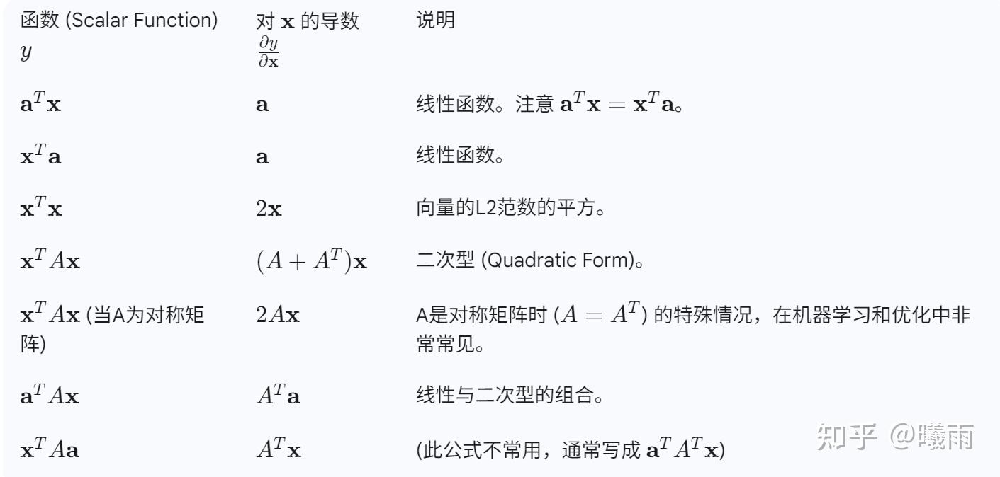
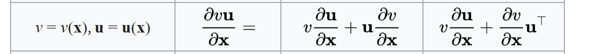

在之前的post（ [矩阵微分乘法法则速记](https://zhuanlan.zhihu.com/p/1939037328074049472) ）中我展示了分子布局下的矩阵微分技巧，这里简单记一下分母布局的矩阵微分。

分母布局仅在标量对向量微分中记号简便，因此也仅说明这一部分的速查表。不过，由于 梯度 $\nabla$ 正好就是标量对向量微分，所以实际上这种布局在机器学习中推导更常见。

> 如果处理的是向量->向量或者矩阵->向量，用分子布局，因为不需要额外扩张维度，定义良好。比如说
> 
> 雅可比
> 
> 天然就是分子布局（竖着排分子）的。

使用中可以用 $\nabla$ 直接替换 $\partial/\partial x$ ，公式完全等价。

特别提一下 $\nabla (u\cdot v)$ 的情况。与分子布局下的“ 转置 左乘”不一样，分母布局下乘法的微分和标量微分法则完全一样：

$\nabla(u\cdot v) = \nabla u\cdot v + \nabla v \cdot u$

注意，都是右乘。同时也可以看出，分子布局和分母布局就是正好差一个转置的关系。

这里多提一嘴搞清分子分母是不是标量的重要性。在这里由于分子是个标量，所以分母布局的解非常好看，但如果分子是一个向量，情况就大变样了：

经验规律是这样的：

1. 分子布局一定左乘，分母一定右乘
2. 分子如果是向量（即存在布局），分子布局不会改变分子布局。分母布局会添上一个转置。
3. 分子如果是标量（不存在布局），分子布局会添加一个转置，分母布局不会（而是顺从分母的布局。

我们再来算一遍 $\nabla^2 \log p$

$\nabla^2\log p = \nabla(\frac{1}{p}\cdot \nabla p) = \frac{1}{p}\nabla^2p - \frac{1}{p^2}\nabla p\nabla^Tp = \frac{p\nabla^2 p -\nabla p\nabla^T p}{p^2}$

需记住，分母布局下，如果要从 $\nabla$ 中提取 $\nabla$ 的话，一定要1）右乘 2）添加转置。

因为多重梯度的情况下会同时出现标量对向量和向量对向量，特别容易头晕，推荐多找点练手的公式推导一下。