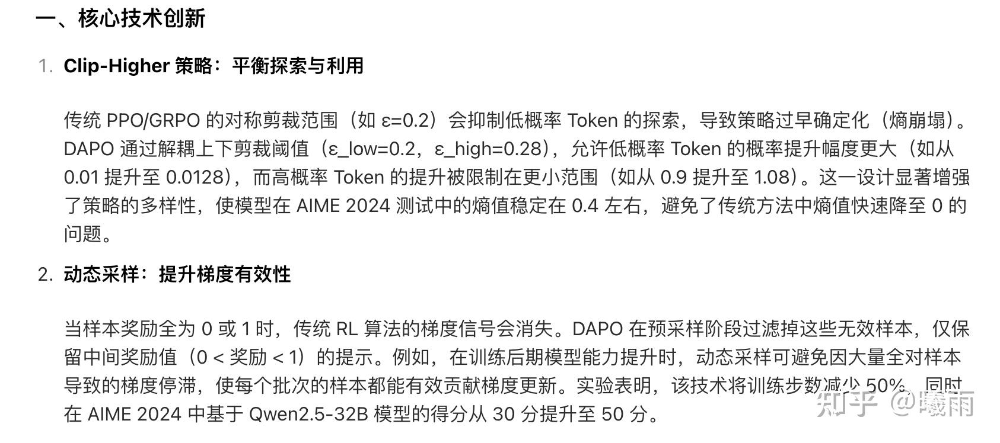

编码过程中常常会遇到一个问题，就是阅读他人源码时会遇到一些没见过的库。当对这些库的编程模型不清时，一个方便的想法就是去问一下大模型。但是大模型总是跟我 “讲八股”。下面是一个例子：

我正在处理图像数据，但我以前没有图像编辑经验。我想要让豆包教我一下 torch transforms 的api。如下：

显然，这个入门并不好。因为我还根本不知道输入格式会是什么样的，同时“裁剪”这些名词 **很不精确** 。而且包含了许多噪声，例如上来就引入一个处理管道的概念，但是说的非常不清楚；介绍api的时候并没有统一的编程模型，比如说输入会是什么样的格式（如果是tensor，形状是什么样的，在哪一维计算的，计算公式是什么）。

豆包只是一个示例，其他大模型也类似。这个编程任务也只是一个示例，其他的，比如算法入门也是一样（比如说 dapo ，如果你去问豆包，它只会给你念一大堆八股，像这样：

它说了半天，你感觉学到什么”具体“的东西了吗？好像没有。

> 对于这种数学算法我会强制要求
> 
> llm
> 
> 全程使用数学公式描述，这样起码能得到勉强能看的东西。但是这通常离工程实践还非常非常远，因为算法高度抽象并且输入格式被简化。

我不太能解释这种“模糊感”是什么，但，阅读大模型给我的指导总是非常吃力（并且我觉得我其实啥也没学到），到最后，我觉得还是看人类的文档更容易理解，就算这些文档字数量非常庞大。

也许调调prompt会更好？但是在我不知道目标任务是什么样子的情况下，我根本不知道怎么通过prompt告诉llm我关心的是什么。

抛砖引玉，希望大家来多多探讨。

> 在我自己写文档的过程中，我认为通过简化但有意义的符号可以大大提高交流效率，并且大幅减少
> 
> tokens
> 
> 。当前tokens消耗量显然是不正常的，带来的latency也很难容忍。