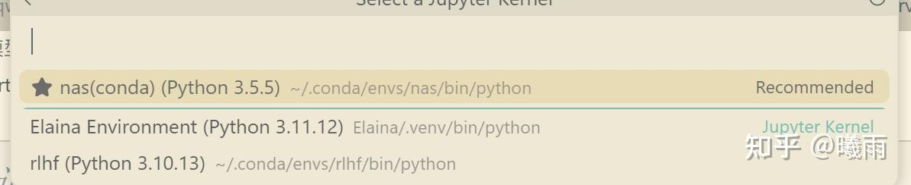

当我们使用vscode时，理论上jupyter会自动发现工作区的虚拟环境；但如果你在工作区里面摆了很多个项目，每个项目都有一个venv时，它就会找不到子目录里面的环境了。这时select kernel是怎么都没办法找到该venv的。

笔者之前被这个问题困扰了许久，最终只能单独为项目打开一个窗口。这带来了许多不便，因为很多项目其实存在关联，想要快速检查之前的日志等数据会变得麻烦。同时诸多窗口会大大增加管理负担。

今天偶然在 Claude 的帮助下搞定了这个问题：使用 jupyter kernel 注册.

**### 步骤1：安装必需包** ```bash *# 如果使用UV管理项目* cd your-project uv add jupyter ipykernel ```

**### 步骤2：注册内核** ```bash *# 激活虚拟环境后执行* python -m ipykernel install --user --name=your-env-name --display-name="Your Project Environment" ``` 参数说明： - `--user`: 为当前用户安装（推荐） - `--name`: 内核的内部名称（唯一标识符） - `--display-name`: 在界面中显示的友好名称 **### 步骤3：验证注册** ```bash jupyter kernelspec list ``` 此时你就可以看到注册好的内核了。刷新vscode就可以在select kernel中看到！


