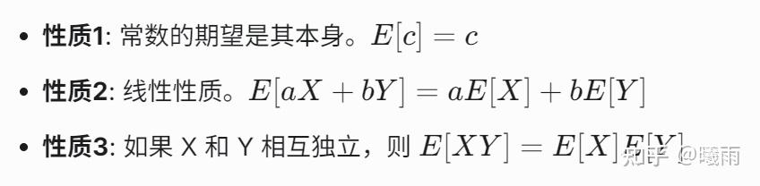
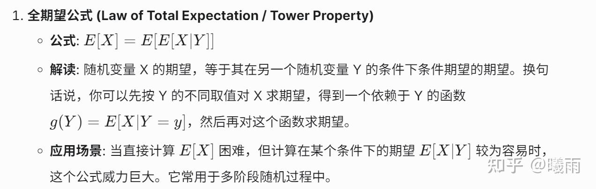
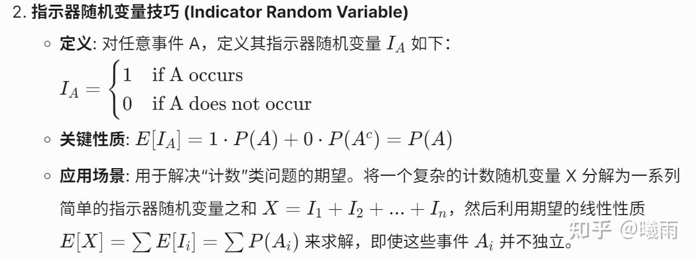
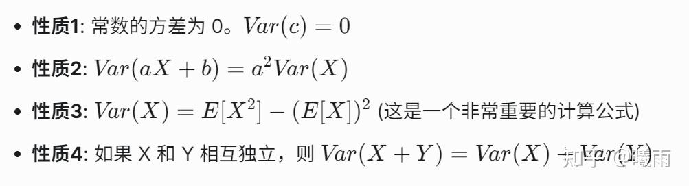

这篇文章以笔记的形式介绍一些常用的概率论公式。文章的主要目标是鼓励并且帮助读者记忆这些公式。这里不会涉及一些基本概念，例如“独立”之类的讲解。它适合长时间没有经过数学训练而希望重拾一些基础的读者。

## 全概率公式

$P(X) = \sum_{i} P(X\mid Y_i)P(Y_i)$

### 贝叶斯定理

$P(X \mid Y) = \frac{P(Y\mid X)}{P(Y)}P(X)$

前一项被称为修正系数。它的意思是：给定 $X$ 的情况下，发生 $Y$ 的可能性相比于 $Y$ 本来就可以发生的概率。这有点像个“X事件在 Y这个“大背景”下的占比”。

例题（慢下来做一次试试！）：

某城市有甲、乙、丙三家工厂生产同一种产品，它们的市场占有率分别为 45%, 35% 和 20%。已知这三家工厂产品的不合格率分别为 2%, 3% 和 4%。问：

1. 从该城市的市场上随机抽取一件产品，求这件产品是不合格品的概率。
2. 如果发现这件产品是不合格品，求它分别是由甲、乙、丙工厂生产的概率。哪个工厂的可能性最大？

解：

1） $P(\mathrm{not\, qualified}) = \sum P(\mathrm{not\, qualified}\mid \mathrm{Factory_i})\cdot P(\mathrm{Factory_i}) = 0.009+0.0105+0.008=0.0275$

2)

以甲工厂为例： $P(A\mid \text{not qualified}) = P(A)\cdot \frac{P(\text{not qualified}\mid A)}{P(\text{not qualified})}$

代入 $P(A) = 0.45, P(\sim \mid A) = 0.02, P(\sim) = 0.0275$ 可得0.3273.

乙，丙分别为0.3818/0.2909，所以最大概率是乙。

## 随机变量

我们称 $X$ 为随机变量，意味着对于任意实数 $x$ ， $X < x$ 都构成一个事件。其 概率密度函数 记作 $f(x)$ ，意味着 $P(X < r) = \int_{-\infty}^r f(x)$

本节有点儿绕，主要是为了下面说明 期望 / 方差 的方便。

## 期望

$\mathbb{E}[X] = \sum xP(X = x) = \int xf(x)\mathrm{d}x$

$\mathbb{E}[g(X)] = \int g(x) f(x)$ 注意，期望符本身是针对表达式中的 **随机成分** 取期望。

期望具有以下关键性质：

此外，期望还具有以下高级性质（credits to Gemini-2.5pro）：

这里用一道例题展示指示器技巧：

求 n 次独立重复试验（伯努利试验），单次成功概率为 p 的二项分布的 $B(n, p)$ 的期望

记每次实验为 $A_i = \mathbb{I}(\text{成功})$ ，显然 $\mathbb{E}[{A_i}] = p$

因此， $\mathbb{E}[{B}] = \sum \mathbb{E}[A_i] = np$

## 方差

$Var[X] = \mathbb{E}[(X - \mathbb{E}[X])^2]$

接下来是一个很少有人听过的（配得上高级！），但是却很好用的公式（并且在我的 [https://aclanthology.org/2025.acl-long.528/](https://link.zhihu.com/?target=https%3A//aclanthology.org/2025.acl-long.528/) 中作为证明n边界的关键定理现身)， **全变分公式** ：

这个公式还有个好用的点是如果表达式很复杂， 你甚至搞不明白哪些量是随机变量的时候，通过条件项慢慢厘清整个式子。

在这里我介绍一个有点“高级”的用法：Rao–Blackwell theorem

对于使用蒙特卡洛估计随机变量 $X$ ，如果可以找到一个随机变量 $Y$ ，构造 $\theta = \mathbb{E}[X\mid Y]$ ，那么对 $Y$ 采样，计算 $\mathbb{E}_{\theta}[\theta]$ 将得到 $X$ 的 **更低方差的无偏估计。**

无偏是显然的，使用全期望公式 $\mathbb{E}[\mathbb{E}[X\mid Y]] = \mathbb{E}[X]$

更低方差，使用全变分公式：

$Var[\theta] = Var[E[X\mid Y]] = Var[X] - E[Var[X\mid Y]]$

由于方差一定大于零， 所以后一项一定大于零。所以 $Var[\theta] \leq Var[X]$

这个公式常见于两种场景下：

1. 混合分布（通过构造指示器使用该公式，见top-nsigma的Range of n节）
2. 分段过程

## 协方差

## 矩阵统计量

## 误差-偏差分析