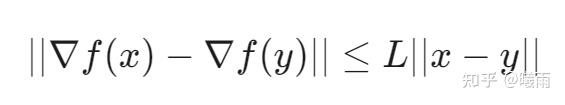

对于给定 $f$ , 试图寻找它的最小值 $x^* = \arg\min f(x)$

梯度下降法 给出了一种寻找局部最小值的方法：

$x_n = x_{n - 1} - \eta \cdot \nabla f$

其中 $\eta$ 就是学习率。那么 $\eta$ 的取值范围是多少的情况下，梯度下降算法可以收敛呢？

显然， $\eta$ 总可以取得非常小以至于可以收敛。所以我们主要关心它的上界。由于函数性质的不同，上界差异较大。这里介绍最简单的一种情形：当 $f$ 满足 Lipschitz光滑 时。

$L-$ 光滑：对于任意的 $(x, y)$

为了避免过于复杂的矩阵微分，这里我们暂时将其视作一元微分进行说明。在 $f$ 二阶可微的情况下，上述条件可以被等价地表述为 $\nabla^2 f \leq L$

考虑 $f(x_{n+1}) - f(x_{n})$

根据 **拉格朗日余项 （取到二阶）** ，在 $x_{n}$ 处

$f(x_{n+1})-f(x_n)\leq \nabla f(x_n)(x_{n+1}-x_n) + \frac{L}{2}(x_{n+1}-x_n)^2$

代入 $x_{n+1}= x_n - \eta \cdot \nabla f$ 可得

$f(x_{n+1}) - f(x_n) \leq \eta(\eta L / 2 - 1)(\nabla f(x_n))^2$

目标是让后者小于零，所以一定有 $\eta \leq 2/L$

实际上还可以优化到 $1/L$ , 见

[https://blog.csdn.net/qq_34758157/article/details/132211025blog.csdn.net/qq_34758157/article/details/132211025](https://link.zhihu.com/?target=https%3A//blog.csdn.net/qq_34758157/article/details/132211025)

[神奇的大学习率：多大才算大，神奇的效用又为何？](https://zhuanlan.zhihu.com/p/562852096) 这篇文章介绍了 $1/L$ 和 $2/L$ 之间的神奇区别。

对于一些简单函数而言，L是很好求的，例如二次函数：

$f(x) = ax^2+bx+c$

它的 二阶导 等于 $2a$ ，因此 $L = 2a$ 。这里可能有人会注意到如果 $a<0$ ， $L$ 好像就可以随便取了。确实如此！但是求出来的解没有意义—— $a<0$ 时这是一个凹函数，梯度下降只会一路狂奔到无穷小。