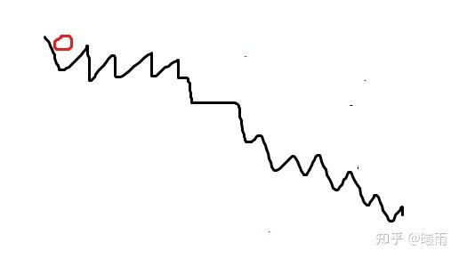

> 下坡它就得狠狠踩油门啊

这篇文章旨在快速简明地速通 SGD 到Adam.

相信很多人都知道最简单的梯度下降方法：

给定起点 $x$ , 对于函数 $f(x)$ ，我们可以迭代地令

$x_{n+1}  = x_n - \eta \nabla f(x_n)$

但是这个建模形式其实和实际情况还有点差距；在实际计算中， $f(x)$ 是被参数 $\theta$ 所表示的，记作 $f(x \mid \theta)$ 。我们只能优化 $\theta$ 而不能优化真实输入 $x$ 。当然了，如果你将 $x$ 视作无关常数，那么就有

$\theta_{n+1} = \theta_n - \eta \nabla f(\theta_n)$

问题在于， **我们无法遍历整个样本空间去计算梯度；实际上，我们只有少量数据样本。**

因此，我们对梯度 **只能估计** 。

SGD就是使用小样本批次对当前梯度进行蒙特卡洛估计。

$\nabla f(\theta) = \mathbb{E}_X[\nabla f(\theta_n\mid x)] \approx \frac{1}{n}\sum \nabla f(\theta_n\mid x_i)$

讲清楚这一点非常，非常重要。我发现很多人（包括之前的我自己）在这里基础不牢靠，觉得SGD好像啥也没干啊。关键就在于没有搞清楚符号的意义，混淆了输入 $x$ 和参数 $\theta$ 。

### SGD with momentum

SGD有一个问题：想象下面这个优化曲面，红色是起点。

真实的损失曲面可能只是一个下降的坡，但是由于SGD是采样估计，所以有很多噪声，导致梯度变化比较大，形成事实上的崎岖路面。但是，大体上来说，我们往下跑就行了。 动量法 就是希望估计出这个“历史大趋势”，而尽量消掉那些暂时的噪声。

这种估计趋势的方法很容易能想到 指数滑动平均 （ [速通现代RL算法](https://zhuanlan.zhihu.com/p/1939655520320468460) 里关于GAE的部分有更详细的介绍）：

$v' = \beta v  + (1-\beta)\nabla f$

很显然，我们有公式 $v_t = (1-\beta) \sum \beta^{i-1}\nabla f_i$ 。指数滑动平均的第一项如何确定是一个臭名昭著的问题；在梯度算法中，我们规定第零项为 $v_0=0$ .这里有一个问题，看 $t=1$ 的情况， $v_t = (1-\beta) \nabla f_0$ 。也就是说，指数滑动平均在一开始不等于梯度本身，而乘了一个滑动项。这点很不优雅，在后面Adam将会详解这个问题。

综上，更新过程改写为

$\theta' = \theta -\eta v'$

注意这个公式和原论文中不同（有一个正负号区别），但是显然，更容易理解；torch也是这么实现的。

所以实际上，与其把这个叫做动量，不如把它称为“使用指数平滑估计梯度的SGD”.

### Adam

对于多变量更新的情况，SGD有一个隐含的问题：每个参数所需要的学习率是不一样的。对于单一参数情况可见 [梯度下降的学习率上界](https://zhuanlan.zhihu.com/p/1939397836732110304) 。总得来说 L-smooth假设下学习率有个上界 2/L（更别提L-smooth是个强得不切实际的假设）。对于不同的参数，这个L是不一样的。用SGD，想要保证稳定性，只能搞一个很小的学习率，这样效率很低。

与其他教程按部就班地从AdaGrad, RMSProp介绍不同，我希望以另一种方式来讲解Adam，即“假设我们什么都不知道，该怎么设计Adam？”。通过上面的分析，我们知道问题的关键在于不同参数周围的崎岖程度不同。那我们能否让所有参数“统一步伐”更新？我们有一个非常非常简单的想法，即使用 $\text{sign}$ 函数：

$w = w - \eta \cdot \text{sign}(\nabla f)$

**这种情况下，我们只关心梯度的方向，不关心梯度更新的步伐大小。**

实际上这就是Adam的核心思想。我们可以这么重写sign:

$\text{sign}(x) = \frac{x}{|x|}=\frac{x}{\sqrt{x^2}}$

然后，向动量学习，使用指数滑动平均EMA来构建更稳定的估计。我们就得到

$m = \frac{\text{EMA}(\nabla f)}{\sqrt{\text{EMA}((\nabla f)^2)}}$

更新公式变成 $w = w - \eta \cdot m$

这里有两个细节

1）如之前所述，EMA在刚开始的时候，得到的是真实梯度缩小之后的值。这会导致启动缓慢。因此Adam使用了一种修正EMA。不妨把它叫做REMA（revised/rescaled EMA）

$REMA = \frac{1}{1-\beta^t}EMA$

这个修正因子的来历如下：

我们考虑 EMA的展开形式

$v_t = (1-\beta)\sum \beta^{i-1} g_i$

你可以把它看成一系列加权。问题是，权值加起来等于一吗？加加试试：

$(1-\beta)\sum \beta^{i-1} = (1-\beta)\cdot \frac{1-\beta^{t}}{1-\beta} = 1-\beta^t$

哦豁，原来不等于一。因此REMA实际上就是把它强行归一化回去了。

2）分母可能为零，需要加一个eps。

所以最终更新公式为

$w = w - \eta \cdot \frac{\text{REMA}(g)}{\sqrt{\text{REMA}(g^2)} + \epsilon}$

这里 $g = \nabla f$

### Weight Decay 和 AdamW

[[NeurIPS2023] Weight Decay的前世今生和隐藏缺陷](https://zhuanlan.zhihu.com/p/672650395)

weight decay本身是一种直觉技术: 模型训练中总是会出现异常值; 而这些异常值似乎总是和过拟合相关. 因此weight decay希望每次更新时, 将权重变小一点. 其公式可以写成

$w=(1-\epsilon) w - \eta \nabla L$

在SGD中, L2 loss总是和weight decay混为一谈, 因为

$L2(w) = \frac{\lambda}{2}|w|^2$

$-\eta \cdot \nabla L2 = -\eta \cdot \lambda w$

显然这等价于 $\epsilon = \eta\cdot \lambda$ 的weight decay

但这仅仅在SGD场景下成立. (带上动量就不一样)

adamw做了什么?

实际上就是正确地实现了weight decay(而不是借助l2 loss)

$w = w - \eta\lambda w - \eta \cdot \text{Adam}(\nabla L)$