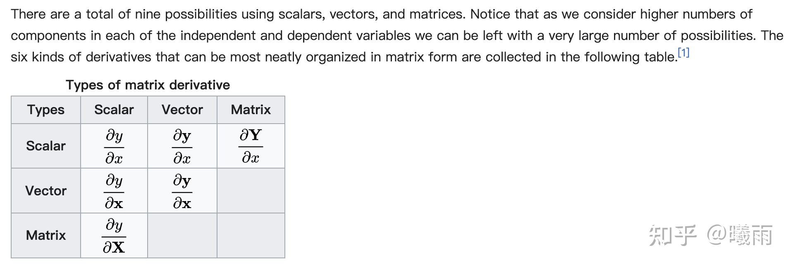
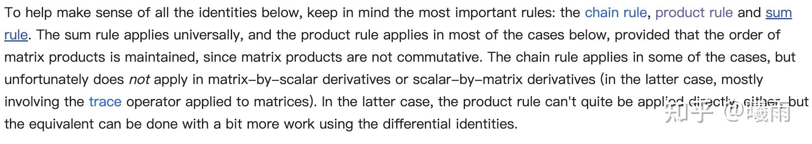

在之前笔者简单地介绍过分子/分母布局下的微分准则 [矩阵微分乘法法则速记](https://zhuanlan.zhihu.com/p/1939037328074049472)

彼时还没有进行什么复杂的运算。今天偶得了一个算式，进行一些复杂的计算。

> 个人所感：数学在很大程度上是一种熟能生巧。如果你对某个结构的“反应”越快，你就越有多余的脑容量去进行“联想”，从而得到突破性的进展。因此保持数学练习很必要。

记 $f(W) = \pmb c^T\sigma(XW\pmb b)$ , $\sigma$ 是sigmoid函数，具有特性 $\sigma' = \sigma \cdot (1-\sigma)$ 。求 $\frac{\partial f}{\partial W}$ 。大写表示矩阵，小写黑体表示向量。

在一开始，本人直接跑去硬套标量对向量求导公式，等算到 $\frac{\partial XW\pmb b}{\partial W}$ 的时候炸膛了：这是一个向量对矩阵微分……

倒查才发现标量对 **矩阵** 求导 **不能** 直接使用链式法则。

解决这种问题最标准的手段是 **trace trick：**

假设我们想求 $\frac{\partial y}{\partial X}$ , 我们可以考虑 $\text{trace}(\mathrm dy)$ , 将其整理成 $\text{trace}(y' \mathrm d X)$ 的形式，那么 $\frac{\partial y}{\partial X} = y'$

这种整理最主要的手段是利用迹的以下性质：

1. 循环不变性 $\text{tr}(ABC)=\text{tr}(CAB)$
2. 内积变外积（交换） $\text{tr}(\pmb u^T\pmb v)=\text{tr}(\pmb v\pmb u^T)$

回到原题，直接看 $df$ :

简便起见，令 $\pmb z = XW\pmb b$ , 于是

$d f = d(\pmb c^T \sigma(\pmb z)) = \pmb c^Td(\sigma(\pmb z)) = \pmb c^T [\sigma'(\pmb z)\odot d(\pmb z)]$

考虑 $d\pmb z$

$d\pmb z = d (XW\pmb b)  =X dW\pmb b$

接下来我们需要通过迹方法将 $d W$ 挪到 **整个表达式** 的最后面。这个地方是最需要小心的部分，不能把 $\pmb b$ 挪到 X前面（这不是整个表达式），不能直愣愣地把 $\pmb b$ 往前挪，因为有内积，有点乘（哈达玛积），etc. 不是一个纯正的矩阵连乘。

整个表达式看上去是这样的：

$\text{tr}(\pmb c^T[\sigma'\odot X\mathrm{d}W\pmb b])$

里面是一个逐元素乘法，可以把系数提取出来。换句话说有这么一个性质：

$\pmb u \cdot \alpha \pmb v = \alpha\pmb u\cdot \pmb  v$

这个写成向量乘法之后比较好看；但是原式没那么容易识别出来。总而言之可以拆分成：

$\text{tr}((\sigma'\odot\pmb c)^T[ X\mathrm{d}W\pmb b])$ (注意转置符号覆盖了 $\sigma'$ )

现在就没有烦人的元素乘法干扰了。只需要将 $\pmb b$ 挪到前面，我们就计算出来最终的矩阵微分：

$\frac{\partial f}{\partial W} = \pmb b (\sigma'(XW\pmb b)\odot \pmb c)^TX$