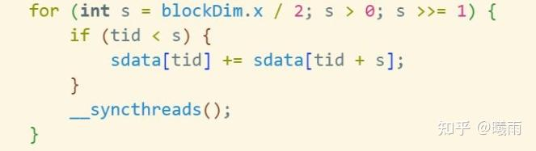

相比于之前我所编写的纯粹的习题记录，这篇文章汲取了 [Python Async，不弄玄虚](https://zhuanlan.zhihu.com/p/1894414626248175945) 的写法，希望以更加直接，不玩弄概念的方式入门CUDA编程。这对我而言也是一次CUDA大复盘。希望这篇文章能帮到各位读者。也希望大家多多分享经验。

> 实际上刷题学习的方法似乎效率并不高，因为CUDA存在多种实现方式，你很难知道自己的实现否是最高效的。

阅读本文时请注册

[https://leetgpu.com/challengesleetgpu.com/challenges](https://link.zhihu.com/?target=https%3A//leetgpu.com/challenges)

该平台已经帮你设置好了环境，因此你无需为复杂的CUDA环境配置焦头烂额。

废话少说，一个最简单的cuda文件是什么样的？

```cpp
#include <iostream>

__global__ void copyArray(const int* in, int* out, int N) {
    int tid = blockIdx.x * blockDim.x + threadIdx.x;
    if (tid < N) out[tid] = in[tid];
}

int main() {
    const int N = 10;
    int h_in[N], h_out[N];
    for(int i=0; i<N; ++i) h_in[i] = i; // 初始化输入数组

    int *d_in, *d_out;
    cudaMalloc(&d_in, N * sizeof(int));
    cudaMalloc(&d_out, N * sizeof(int));

    cudaMemcpy(d_in, h_in, N * sizeof(int), cudaMemcpyHostToDevice);

    copyArray<<<1, N>>>(d_in, d_out, N); // 启动核函数

    cudaMemcpy(h_out, d_out, N * sizeof(int), cudaMemcpyDeviceToHost);

    std::cout << "h_out[0] = " << h_out[0] << ", h_out[9] = " << h_out[9] << std::endl;

    cudaFree(d_in);
    cudaFree(d_out);
    return 0;
}

```

这里我将简要地使用一问一答快速地展示基本概念（我发现这比陈述更容易学习！）：

1. 如何在GPU上创建数组？
2. 如何将CPU数据传输到GPU上？
3. GPU能干啥？
4. blockIdx, blockDim, threadIdx, 这是什么东西？
5. copyArray前面的__global__是什么？
6. copyArray<<1, N>>是什么意思？
7. blockIdx.x * blockDim.x + threadIdx.x是什么？
8. 在GPU上该如何访问数据？
9. global函数是怎么执行的？

理解了这些基本概念之后（实际上，我推荐你背诵这些概念！可以将以上内容复制给Gemini让它为你出题反复检验），我们已经可以基本搞清楚完全并行的程序是怎么写的了。但是，要想完成真正的并行计算，我们还需要解决一个重要问题：即线程间通信和同步。

### 线程同步

cuda提供一个 **block级别的同步原语： `__syncthreads()`**

请注意，cuda没有原生的grid级别同步原语。如果你需要Grid同步，最好是写两个global函数（又称核函数，kernel），顺次启动它们。

__syncthreads会强制线程停在这个调用处，直至所有线程都抵达这句话。

### 线程通信

线程通信是通过内存来实现的。

譬如之前的copyArray中，所有threads都可以看到Input数组的指针，也因此可以访问Input的任何内容。一个理论上的通信模型可以这样实现：

```cpp
void say_hello(int *input, int N, int dst){
     input[dst] = 1;
}

void function(...){
   if threadIdx.x == dst:
      __syncthreads();
      print(input[dst]);
   else:
      say_hello(input, N, dst);
      __syncthreads();
}

```

由于threads是SIMD执行的，因此只能通过分支的方法来编写不同执行路径。请注意两方调用同步原语的位置：对于发送方而言，先写后同步；对于读者而言，先同步后读。

当然，这个写法非常低效，实际中不会这么写。CUDA程序最常见的写法是，每个threads向不同位置写入之后，同时调用__syncthreads()使得写入对其他threads生效。

### 共享内存

GPU存在分层内存模型。cudaMalloc分配的内存被称为 **全局内存** ，就像CPU的DRAM一样。

而 **block内部** 存在叫做 **共享内存** 的，可以类比成高速缓存的内存区域。幸运的是我们可以控制这块区域。

```cpp
__global__ void kernel(){
      __shared__ float sm[16];
}

```

通过这种__shared__前缀的方法，我们声明了一个共享内存。请注意，该语句是一个 **block级别语句。** 虽然每个thread都执行了，但是同一个block中只有一个大小为16的sm（而不是每个thread一个）。

该内存对block内部所有thread可见，而外部不可访问。

对共享内存的读写非常快，因此如果运算需要频繁读写数据，就可以先将其加载到共享内存中，然后在共享内存中读取。

Q：什么叫“加载到共享内存中”?

A：没什么玄乎的。就是 `sm[0] = input[i]` 。赋值语句意味着加载。

使用共享内存加速计算的经典应用是矩阵乘。可以参见 [CUDA（三）：通用矩阵乘法：从入门到熟练](https://zhuanlan.zhihu.com/p/657632577) 。本文的主要目的是帮助读者克服对CUDA的畏难情绪，快速入门，因此不深入介绍。

### reduce

reduce运算非常普遍；最常见的reduce是sum，这里用sum来介绍。

不要动任何脑子，背诵以下循环：



这里blockDim.x可以换成任何描述sdata长度的变量。这里的加号可以换成任何满足 f(a, b, c) = f(a, f(a,b))的算子，比如说最大值。

对于任何需要reduce的地方，默写这个循环即可。具体的解释可以参考 [CUDA reduce 算子详解](https://zhuanlan.zhihu.com/p/1905661893739283464) 。 但我个人的体验是， **追求理解不如追求娴熟** 。

### CUDA进阶快问快答

1. 如何启动一个2D的block？
2. 2D grid + 2D block, 如何计算当前thread在矩阵中的行row和列col?
3. 什么是warp？
4. 什么是warp divergence?
5. 什么是 bank conflict ?
6. 什么是Memory Coalescing？

本文暂时到此为止。笔者将会在想起来的时候更新有用的知识。