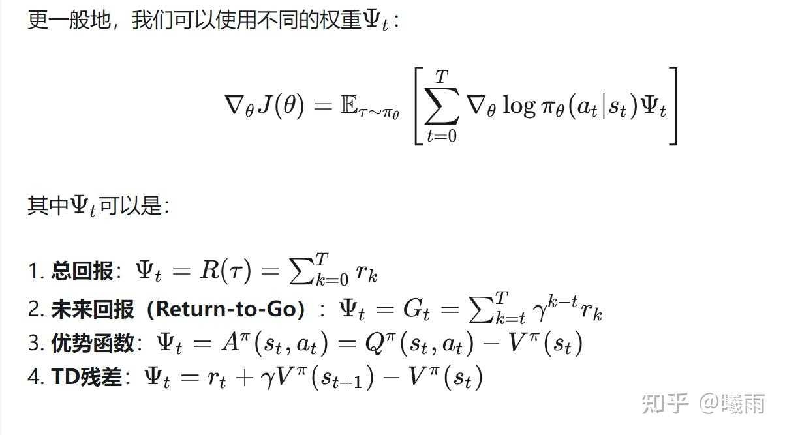
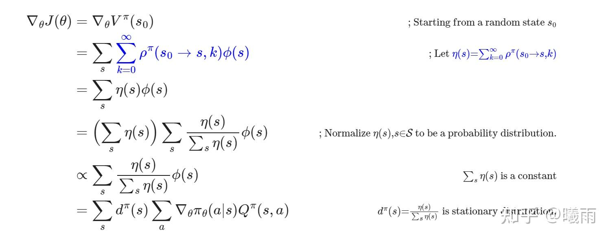
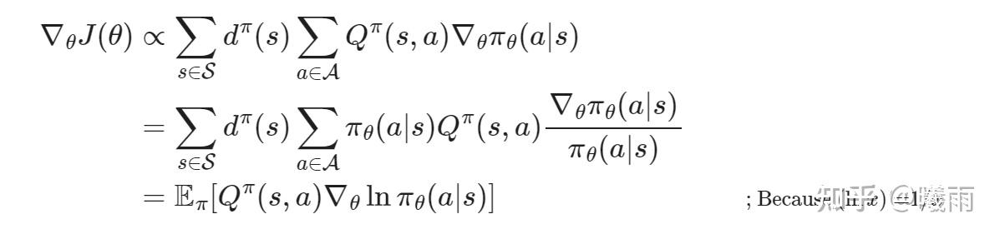
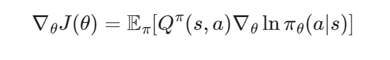

这篇文章是一个简明的，从头开始的RL公式推导笔记。这篇文章不追求符号的100%严谨，而主要为了降低读者对于数学公式的恐惧心理。

这篇笔记假设你理解 状态 State， 动作 Action和 奖励 Reward. 因为讲八股非常消磨精力。

## 目标

RL的目标是什么？

$\max J = \mathbb{E}_{\tau} [R]$

$\tau$ 是轨迹， $R$ 是该轨迹得到的奖励之和。这个定义简单易懂：我们需要在可达轨迹的分布下最大化能得到的奖励。 $R$ 有多种表现形式，最简单的形式是折扣奖励 $R=\sum \gamma^t r_t$ ，其中t是离初始状态的距离，r是从上一步转移到当前状态的奖励。此外，常用的 $R$ 也可以被定义为价值函数 $V$ ，这种情况下 $\mathbb{E}$ 的下标要变成初始状态 $s_0$ ，即初态的稳态分布。很多教程喜欢在最重要的目标上面跳步而直接去看梯度，这导致我之前学起来的时候很难记住公式（策略梯度有很多个版本）。

## 梯度

机器学习广泛地运用梯度求极值。那么 $J$ 的梯度该如何计算？我们以最简单的奖励形式来看一下。

$J = \mathbb{E}_{\tau}[R] =  \sum p(s)\cdot r_s = \sum \prod p(s_{j}|s_{i})\cdot r_s =\sum \prod \pi(s_i, a) \cdot r_s$

$\pi(s, a)$ 就是"策略"，它表示在s状态下执行动作a. 我们可以参数化 $\pi$ ，即 $\pi(s, a \mid \theta)$

对上式求梯度（对 $\theta$ , 符号太麻烦了就省掉了)

$\nabla J = \sum \nabla \prod \pi \cdot r$

由于 $\nabla f = \nabla \log f\cdot f$ , 右侧变成了

$\nabla J = \sum \nabla(\log \prod \pi \cdot r)\cdot p(s)$ . 注意r 与 $\theta$ 无关所以你放在梯度里面还是外面都行。这里的p就是那一坨连乘项。

这时，如果你再仔细看看这个表达式，就会惊喜地发现，它形如：

$\sum f \cdot p$ 的形式，而这就是 $\mathbb{E}_p[f]$ !

所以 $\nabla J = \mathbb{E}_{\tau} [\nabla \sum \log \pi\cdot r]$ . **最外层的均值项可以通过 蒙特卡洛算法 消去。**

这里使用的是简单的及时回报进行推导，但是很容易看出，只要r和theta无关，这个表达式是什么都无所谓，所以可以记一个通用公式：

$\nabla J = \mathbb{E}_{\tau} [\sum \nabla\log \pi \cdot R]$

sum是对整条轨迹上每一步求和，所以单步项就是log pi * R的梯度。

R的可选项如下所述，但绝不止这些。某些符号将在下一节介绍。

## 因果律

在这里，我们证明 $R = \sum_{0}^T r_k$ 与 $R = \sum_{t}^T r_k$ 最终得到的梯度估计是一致的。后者称为 return-to-go （期望回报）。

换句话说，我们希望证明

$\mathbb{E}[\sum \nabla \log \pi_t\cdot \sum_0^{t-1} r_k] = 0$

注意到在 $t$ 给定的时候，后面这个奖励项是个定值，可以被提出来，于是这个式子可以化作

$\mathbb{E}[\sum \alpha \cdot \nabla \log \pi_t] = \sum \alpha\cdot \mathbb{E}[\nabla \log\pi_t] = 0$

最后一步被称为EGLP（Expected Grad-Log-Prob Lemma）引理。其证明很简单，因为 $\int \nabla \log p\cdot p\,\mathrm{d}x = \int \nabla p\,\mathrm{d}x = \nabla 1 = 0$

值得一提的是，如果我们考虑折扣因子 $\gamma$ 的情况下，总奖励为 $R = \sum_k \gamma^k r_k$ , return-to-go为 $G_t = \sum_{k}\gamma^{k- t}r_k$

return-to-go偏移了 $\gamma^{-t}$ 。很多教程在这个地方跳步，或者和 基线 的数学等价混为一谈，说这个也是等价的。但其实，这个和原始的总折扣回报 **确实是不一样的** ，（某些教程老说数学上等价给我绕晕了）。直觉上，这体现为对较近奖励的增强。需要注意的是总奖励和return-to-go只是最开始的那个 $R(\tau)$ 的不同形式，它们不一定非要数学上一样，只要make sense, 也是可行的。实际上到后面介绍Q, V的时候会发现这两个形式在概率意义上确确实实差了一个常数项（即省去的 $\sum \eta$ ）（这一块儿总之稀里糊涂的，蹲评论区大佬）

## 基线

由上面的证明过程不难看出，只要你对 $R$ 加上一个和未来奖励无关的项 $b$ ，使得 $\mathbb{E} [b\nabla \log \pi_t]$ 计算的时候， $b$ 是个定值可以被提出来，那么就不会影响到最终的结果。

因此策略梯度也常被写成

$\nabla J = \mathbb{E}_{\tau}[\sum \nabla \log \pi \cdot (R-b)]$

恰当的 $b$ 有助于降低方差。举个例子：游戏过程中agent可以一直拿到70分，80分，如果不加以区分，就会导致鼓励任意行为（只是鼓励的程度不同）；而如果设置b=75，就区分了两者，更有效地进行更新。

## 单步

在上面的叙述中更新过程都是针对整个episode $\tau$ 而言的。有时候这很麻烦，因为执行一整局很耗时。

幸运的是，

$\nabla J = \mathbb{E}_{\tau}[\sum \nabla \log \pi \cdot R] = \sum_{\tau \sim f(\tau)} p(\tau)\cdot \sum[\log\pi \cdot R] = \sum_{(s_0, a_0,\cdots)}\sum\sim$

（因为公式太长了后面写得省略了一点）

我们可以从展开式中看出，这个式子是有可能改写成 $(s, a)$ 下标求和的。唯一的问题是当前表达形式仍然是以episode的 $(s_0, a_0, s_1\cdots)$ 这样的状态-动作序列遍历的。如果我们需要将其拆出 $(s, a)$ 下标遍历，就需要指定 episode的长度，即固定一个步数进行求和。这将十分复杂。

具体的推导过程可以参考

[三、PG/VPG/Reinforce 策略梯度方法](https://zhuanlan.zhihu.com/p/545599150)

最终的表达式都是

前面乘了一个 $\eta$ 求和项的形式。这个是访问当前状态的次数，而 $\rho$ 就是我上面提到的那个给定步长的转移概率。而 $\eta /\sum \eta$ 就是单个状态的稳态分布。

> 这里省掉了sum eta，就是之前我提到的return-to-go和整个episode回报的差异点。本质上来说，return-to-go是对Q的估计而R是对episode回报的估计，两者差了这么一个访问系数。

得到稳态分布之后就可以写成期望形式啦。

注意图片中已经直接使用了 $Q$ ，我们将在之后介绍它。

## Q, V

老实讲，当我从头一步一个脚印学RL的时候我才发现， **根本就见不着Q, V** 这些符号的影子！我们只需要知道奖励和策略就足够完成推导了。由此可见，这些符号的引入并不是自然的。

我们先从较为容易介绍的 $V(s)$ 说起。这个函数定义了当前状态下，遵循当前策略（注意和策略有关系），预期得到的总回报。换句话说

$V(s) = \mathbb{E}[R(\tau)\mid s_0=s]$

如果你足够细心，就会发现这个定义等于 return-to-go的期望。

而 $Q(s, a)$ 被定义为当前状态下，采取动作 $a$ 预期得到的总回报。即

$Q(s, a) = \mathbb{E}[R(\tau)\mid s_0=s, a_0 = a]$

很显然，假设 $(s, a)$ 转移到了 $s'$ ，那么 $Q(s, a) = \gamma P(s\rightarrow s' \mid s, a)\cdot V(s') + R(s, a)$

反过来 $V = \mathbb{E}_{a}[Q(s, a)]$

使用 Q函数 表述的策略梯度定理如下：

与之前同理，我们可以对Q减去一个基线 $b$ 来优化方差。在这里，最优的基线为 $V$ 。

优势函数就被顺势定义为 $A = Q - V$

在实际计算过程中，我们不可能知道真实的 $Q, V$ ,因为这要求无限步执行当前策略。所以，通常使用另外的网络进行估计。如何估计就造就了多种多样的算法。

to be continued....