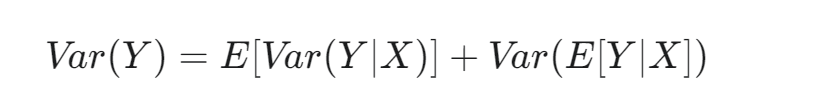
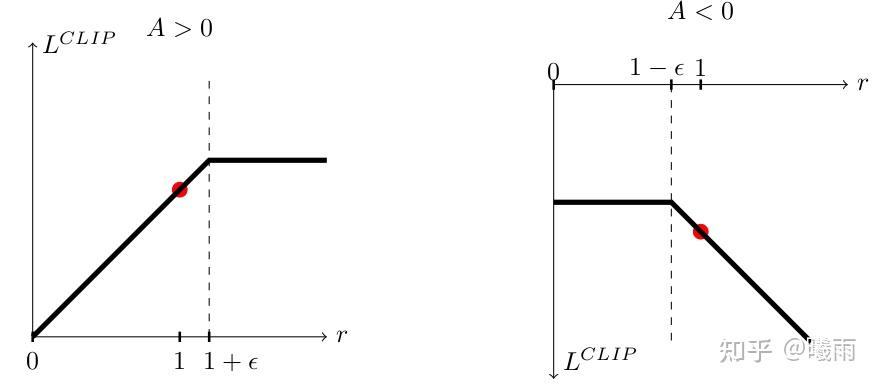

本文是 [速通RL基础](https://zhuanlan.zhihu.com/p/1938901554229928583) 的后续

一句话总结：现代RL算法的一切都是 **估计优势函数** 。

> 所谓现代RL，我在这里想指的是使用神经网络估计Q/V等关键函数的RL算法，而不是类似于Q-learning或者REINFORCE等算法。它们有些年头了。

## Actor-Critic

Actor-Critic是一种框架。在该框架内，算法使用至少两个神经网络：

1） Actor: 这个神经网络用于计算策略函数 $\pi$

2) Critic: 这个神经网络用于 **估计** 价值函数 $V$

我们知道，优势函数 $A = Q- V$ , 但是我们并没有 $Q$ 网络。不过，我们知道， $Q$ 和 $V$ 之间是可以相互转换的。存在公式：

$V(s_t) = \mathbb{E}_{\pi} Q(s_t, a)$

$Q(s, a) = r(s, a) + \gamma\sum P(s' \mid s, a) V(s')$

其中 $P$ 是状态转移概率。

不难看出，使用 $V$ 的估计可以对 $Q$ 也同样进行估计，但问题是我们不知道状态转移概率（这被称为model-free学习）。

但不要慌，蒙特卡洛大人会赢的：

$Q = r + \gamma \sum P V' = \sum P(\cdot) \cdot r + \gamma\sum P(\cdot)V' = \sum P(\cdot) \cdot (r + \gamma V')$

注意第一项变形是因为 $\sum P = 1$

显然这又是一个 $\sum f \cdot p = \mathbb{E} f$ 的形式。只待蒙特卡洛大人出手，便轻而易举地打掉了可恶的期望符（

综上，我们可以通过蒙特卡洛采样得到 $Q$ 的一个一阶估计 $r + \gamma V'$

再用它减去 $V$ , 就是我们大名鼎鼎的TD误差了~

$\delta_t = r_t + \gamma V_{t+1} - V_t$

所以本质上，时序差分就是优势函数的一阶估计（同时它是无偏估计）。于是，我们就可以得到Actor-Critic中对 $A$ 的估计算法了：

$A(s, a) \approx \delta_t = r_t + \gamma V_{\theta}(s_{t+1}) - V_{\theta}(s_t)$

$V_{\theta}$ 就是Critic网络。看上去，它需要两次前向。但是由于我们每采样一条序列就会对整条序列上所有的 $(s_t, a, s_{t+1})$ 计算，所以可以复用中间重叠的部分，均摊也只需要一次。

再带入PG的更新公式，就可以更新actor的参数了。

同时不要忘了， $V_{\theta}$ 只是估计！所以这个网络也是需要优化的！

但是问题来了，我们并不知道真实的 $V_{true}$ 。退一步讲，我们可以由现有的数据推导出一个更精确的估计吗？

这里我们需要使用 贝尔曼方程 ：

$V(s_t) = E_{\pi}[R +  \gamma V(s_{t+1})]$

> 老兄，怎么又见面了

类似地，我们可以用蒙特卡洛拿掉这个期望符。因此，Critic的拟合目标为 $r + \gamma V(s_{t+1})$ 。而它的输出为 $V(s_t)$ 。实际使用均方误差更新，刚好为 $\delta_t^2$ （通常会乘一个 $1/2$ 使得求导后消掉系数）。

这里会陷入一个很奇怪的境地，即 $r+\gamma V(s_{t+1})$ 既是 $Q_t$ 的估计，又是 $V_t$ 的估计。这是因为我过度简化了符号，省略了动作项（而Q和V唯一的区别就在动作上）。可以想象，如果有一个大批次，里面可能采用各种不同的 $a$ 。此时，它们只会更新对应的 $Q$ ，但是全都会更新同一个 $V$ 。这样就更容易发现两者的区别了（根本原因是拆期望符的时候下标分布不一样）。

从推导过程中不难看到，TD误差估计对于 Actor 和Critic 的误差来自于：

对于 Actor , 它拆掉了转移概率项，同时依赖于两个不一定精确的 $V$ 估计。

对于 Critic ，它是自举式（bootstrap）更新，即用自己生成的数据迭代自己（更新目标包含自己的输出）。这种更新方式的最大问题是非常依赖于初始值和策略 $\pi$ 所带来的reward $r$ 。试想一下，如果策略非常垃圾，一直都在反馈负奖励，那么Critic将很快滑落到看什么都坏的境地去。问题就在于， **初始策略非常垃圾** 是很常见的。

最后，这里介绍一下detach问题。在上面的推导过程中， $r + \gamma V(s')$ 通常视作目标（也称TD目标）。然而这里的 $V(s')$ 实际上是Critic网络算出来的，在自动求导框架中会为Critic参数添加梯度。目标不应该被梯度下降优化，所以在实现时需要注意。具体来说，

1. 对于Actor而言，TD误差 $\delta_t$ 需要执行detach操作以避免对于Critic的意外更新.
2. 对于Critic而言，需要将TD目标 $r+\gamma V(s')$ 进行detach.

> ……晚上写得好困。之后再慢慢更新吧~ 争取写到现在最新的RL算法。其实本质上一直没跳出AC框架，只是在里面想办法稳定训练过程。
> 
> 遥想几个星期前我还没有勇气看数学公式。现在似乎大脑升级了一点。我认为其中最关键的改变是，我试着去背公式了。
> 
> **理解不如娴熟**
> 
> 。背诵这个过程其实强制你
> 
> **仔细阅读公式**
> 
> ，在这个过程中你会理解它，并且试着为它添加联想以便于记忆。公式逐渐积累之后会形成一种惯性，这就像你看英语文章，如果你每个词都要查词典，那肯定是看不下去的。
> 
> 另外我很感谢
> 
> [@东川路第一伊蕾娜](//www.zhihu.com/people/0bf5ea05bcb3f318f8d3b6f35abcba9d)
> 
> 的帖子，譬如
> 
> [Open and open again--如何有极强的执行力？     （年度总结预览版）](https://zhuanlan.zhihu.com/p/13821739749)
> 
> 。比较让我感叹的是1月我还给伊蕾娜评论过（才不是因为都是伊蕾娜），半年过去后感觉自己不进则退了。好吧，也有些习得性无助和性压抑作祟，毕竟我可是
> 
> [在中国科学技术大学 (USTC) 就读是怎样一番体验？](https://www.zhihu.com/question/24370236/answer/1928111712537673813)
> 
> 的作者（这种文章成了代表作是不是这辈子没有了）。不管怎么说，伊蕾娜桑还是太勝ち組了；对于像我这种阴角，我会提供一个比较具有实操性的方案：试着照镜子保持微笑。此外，如果你不知道怎么open，可以直接私信我聊聊你对某某问题的意见。在我跟其他校友分享伊蕾娜桑的时候发现，科大很多组有个不好的习惯，就是组内互防。Idea不流通，Coauthor基本没有，最后就是大伙都在受折磨。实际上，“要是每个idea都work，我早就著作等身了”。因此任何形式的交流都是欢迎的。

8/16接续

## 如何分析使用TD估计的Actor-Critic？

一般很多教程会急吼吼地跑去下一个知识点，但我会在这里稍作停留，介绍一下一般性的分析方法。

我们目前面临的问题，正如之前所总结，可以定性地说成：

1. 对Q的估计不准
2. 对V的估计不准
3. 对V的更新不准
4. 对Actor的更新不准

如果细心一点，可能你会认为2是1的原因。不过，Q的估计不准除了偏差意义上的（即值本身不准），还存在方差意义上的（即采样误差）。我们需要较为细致地通过数学公式刻画这种“感觉”。为了使得符号易懂，我们约定 $V_{\theta}$ 为Critic估计值， $Q_{\theta}$ 是估计值（TD目标）。 $V, Q$ 则是真值。

### Oracle

通常我们使用“Oracle”（神谕）这个概念来描述最佳情况。毫无疑问，最佳情况一定是

$V_{\theta} = V$

然而,由于 $Q_{\theta}$ 并非一个独立网络，我们直接假定它等于 $Q$ 没有任何意义。我们好奇的是，如果Critic被完美优化了， $Q_{\theta}$ 是否等于 $Q$ ？

由 $Q = r + \sum P(s' \mid s,a) V(s')$ ，显然两者并不直接相等。由之前的推导不难发现， $Q_{\theta}$ 是 $Q$ **在状态转移分布下的一个样本** 。

特别地，对于状态转移确定的情况， $Q_{\theta} = Q$ 。这种情形的代表，比如下棋，以及大模型生成。对于带随机过程的，例如打牌（有抽牌这个随机因素），两者是不精确相等的。出于简便，我们主要考虑前者。

### 如果 $V_{\theta} \not= V$

在这种情况下， 我们必须以更为严肃的态度面对上面的自举更新过程。

到底，自举在举什么？

首先，请注意优化本身不是针对 $V$ ，而是针对参数 $\theta$ 。即，我们希望找到一个 $\theta$ ，使得 $V_{\theta}$ 尽可能逼近 $V$ .

$\arg\min_{\theta} \mathrm{dist}[V_{\theta}(s), V(s)]$

我们没有办法知道真实的 $V(s)$ 。但是，我们知道， $V$ 一定满足

$V(s) = r + \gamma V(s')$

故而，该问题变成：

$\mathrm{find}\,\theta, \mathrm{s.t.} V_{\theta}(s) = r + \gamma V_{\theta}(s')$

只要优化过程最终确实使得上式成立，那么我们迭代地将上式展开到终止状态，就会发现 $V_{\theta} = G_t = V$ .

可以发现，如果这个自举过程最终收敛了，那么上述所提到的1/2两个问题都不存在。关键问题就来到了第三点，也就是这个自举过程的更新情况如何呢？

### Critic梯度的方差

得益于现代自动求导的便利，Critic的更新通常直接使用TD误差的均方和。这种情况下，其梯度可以写成

$\nabla_{\theta} J_{\mathrm{Critic}} = -(r + \gamma V_{\theta}(s') - V_{\theta}(s))\nabla_{\theta} V_{\theta}$

> 注意负号，以及括号内第二项被detach了所以不会额外产生梯度

最后一项是网络本身的梯度，在这里我们不关心。

衡量更新过程稳定性的关键指标即 **梯度的方差** （对于其他场景也一样，当你想要改进训练过程的时候，算算方差先）。在这里，

$Var[\nabla J] \propto Var[r+\gamma V_{\theta}(s') - V_{\theta}(s)]$

注意 $s$ 和 $r$ 都是随机变量并且两者相关。这里介绍一下全变分公式：

根据全变分公式我们可以固定 $(s, a)$ ，有

第一项：

$E[Var[r(s, a) + \gamma V_{\theta}(s') - V_{\theta}(s) \mid s, a ] ]$

这里我们取固定转移概率假设，即给定 $(s, a)$ 之后， $s'$ 是固定的， $r$ 也因此固定。那么内层就是一个定值，因此第一项是零。

第二项：

$Var[E[r(s, a) + \gamma V_{\theta}(s') - V_{\theta}(s) \mid s, a ] ]$

由上分析可知内层是个定值。如果我们简单展开会发现基本上还原了回去，似乎没有什么新知识；但这里有一个重要性质：

$r$ 和 $V_{\theta}$ 无关

请注意， $r$ 和 $V$ 相关，但是和 $V_{\theta}$ 无关，因为 $V_{\theta}$ 是你的critic网络算出来的。

由这个性质，我们可以将上面的方差展开：

$Var = Var[r] + Var[\gamma V' - V]$

不难看到，梯度的方差和

1. 奖励方差
2. 估计方差

两项有关。进一步地，奖励方差的本质是 $\pi$ 的优劣（良好的策略应该比较稳定地获取奖励），估计方差则涉及到网络对于状态的拟合程度。此外，这个公式展示了基线是如何降低方差的：后一个方差项内，如果 $V$ “紧随” $V'$ 变动，就可以降低方差。（遗憾的是我们不能根据 $s'$ 手动调整这个值，因为基线必须和未来无关）。

> 通过全变分公式可以很简单地分析REINFORCE的方差（即使用G_t估计优势函数）。通过固定(s, a)对，每一步的奖励都是无关的，因此其方差等于
> 
> $\mathbb{E}_{\mathrm{episode}}\sum Var[\gamma^t r]$
> 
> , 非常高。

进入下一部分前，快速回顾一下：策略梯度的公式是什么样的？（可以试着默写一下）

### Actor梯度的方差

Actor的梯度可以写成

$\nabla J = \mathbb{E}[\nabla \log \pi \cdot \delta_t]$

麻烦的是，不仅 $\delta_t$ 是随机变量， $\pi$ 也是个和 $(s, a)$ 有关的随机变量。更麻烦的是，这两者是相关的，毕竟 $\pi$ 就是分布本身。因此，这里只能做出一些定性的分析：

1. pi的方差代表了策略的极端程度。方差越低，策略越极端，探索效率越差，但更新越稳健。
2. delta_t的方差，如前所述，是策略获取奖励的稳健程度。注意，极端策略也容易导致低方差，但是可能奖励本身很低。

从这个分析中不难看出，Actor的训练过程是个正反馈循环，即策略显现出的偏向性会被放大到更新过程中来。初始值非常重要。

## GAE

在之前的方差分析过程中，细心的读者不难发现，由于我们添加了一个独立的Critic，使得方差被分解，使得方差只与 **不可控的单步奖励** 和 **可控的估计方差** 组成。这说明，Actor-Critic有助于降低方差（只要你的Critic估计方差不大）。然而，AC算法引入了估计网络，这使得Q/V估计不准确。

直观上不难发现：

1. 真实奖励：（由于需要计算所有步而导致）方差大、无误差
2. Q/V估计网络：方差小，误差大

GAE就是一种试图从两者间取得平衡的方案。非常有“水多了加面面多了加水”的感觉。

具体来说，对于 $Q_t$ , 我们可以把它 **展开到一半** ，就会变成：

$Q_t^{(K)} = \sum \gamma^i R(s_{t+i}, a_{t_i}) + \gamma^K V(s_{t+K})$

这个K可以任意大，都是合法的 $Q_t$ 估计。显然， $K$ 越大，偏差越低，方差越大； $K$ 越小，偏差越大，方差越小。将这些估计减去 $V(s_t)$ ，我们就得到第 $K$ 步的优势估计：

$A^K = Q^K_t - V(s_t) = -V(s_t) +\sum \gamma^i R(s_{t+i}, a_{t_i}) + \gamma^K V(s_{t+K})$

这里有一个小数学技巧： $\gamma^2 V(s_{t+2}) + r_t + \gamma r_{t+1} - V(s_t) = r_t + \gamma V(s_{t+1}) - V(s_t) + \gamma ( r_{t+1} + \gamma V(s_{t+2}) - V(s_{t+1})) = \delta_t + \gamma \delta_{t+1}$

即 **相邻TD误差滑动一步再加起来可以消掉中间的** $V$ . 这样， 之前的 $A^K$ 就还有更加漂亮的表达式：

$A^K = \sum \gamma^i \delta_{t+i}$

为了兼得之前的偏差-方差特点，GAE直接做了一个指数滑动平均。这里简单介绍一下指数滑动平均；对于数列 $a_i$ ，其指数滑动平均后的数列 $b_i = \lambda b_{i-1} + (1-\lambda) a_i$

通项公式可以简单记作 $b_i = (1-\lambda)\sum\lambda^i a_i$

所以GAE中得到的 $A$ 估计 $\hat{A}$ 为

$\hat{A} = (1-\lambda) \sum \lambda ^i A^i \stackrel{K\rightarrow \infty}{\longrightarrow} \sum (\gamma\lambda)^i \delta_i$

### PPO

> 大胆， 你怎么不讲
> 
> TRPO
> 
> 就讲PPO？

我们知道，PG公式可以写成

$\nabla J = \mathbb{E}_{\pi}[\nabla \log \pi \cdot A]$

而

$\mathbb{E}_{\pi}[\nabla \log \pi \cdot A] = \int \pi\cdot \nabla \log \pi\cdot A = \int \frac{\pi}{\pi'}\cdot  \pi' \cdot \nabla \log \pi \cdot A = \int \pi'\cdot [\frac{\pi\nabla \log\pi}{\pi'}\cdot A] = \int \pi'\cdot [\frac{\nabla \pi}{\pi'}\cdot A] = \mathbb{E}_{\pi'}[\nabla\frac{\pi}{\pi'}\cdot A]$

其中 $\pi'$ 是任何一个其他策略。请注意喽，这里使用log trick消掉了log（很多教程在这里跳步！）. 我们可以将目标重写为

$J = \frac{\pi}{\pi'}\cdot A$

这个变形被称为重要性采样。通过这种方式可以使用其他策略采样的数据进行更新。

PPO做的事情非常简单： $\frac{\pi}{\pi'}$ 可能非常大，导致梯度更新不稳定。最简单的想法：

$J = \text{clip}(\frac{\pi}{\pi'}, 1-\epsilon, 1+\epsilon)\cdot A$

这限制了 $\frac{\pi}{\pi'}$ 的比率。但是，真正的PPO只是一个 **单边裁剪** ，它只限制了增加某个行动的概率而没有限制惩罚行动的概率：

$J = \min(\frac{\pi}{\pi'}\cdot A, \sim)$ , $\sim$ 表示上式。

可以参考这个帖子

直观的理解，这是因为更新目标只希望两种情况：

1. 比率在正常范围内
2. 比率不在正常范围内，但是向着正常范围移动

对于左图， $A> 0$ 意味着在向上攀升，因此左侧并未受限而右侧受限；右图相反。

TRPO可能将会单开一个帖子，因为实在是Heavy math……